# System Diagrams

## Catarman Dog Pound Management System

This document contains the System Diagrams for **Chapter 3: System Design** of the capstone project.

### Table of Contents

| Section | Diagram | Description |
| :-------: | --------- | ------------- |
| 1 | System Architecture | Overall system layers and components |
| 2 | Context Diagram (Digital) | Level 0 DFD - Proposed system boundaries |
| 3 | Functional Decomposition | Hierarchical function breakdown |
| 4 | Entity-Relationship Diagram | Database entities and relationships |
| 5 | Module Interaction Matrix | Module R/W access relationships |
| 6 | Context Diagram (Manual) | Level 0 DFD - Old paper-based system |
| 7 | Use Case Diagram (Manual) | Previous paper-based system |
| 8 | Use Case Diagram (Digital) | Current computerized system |
| 9 | Data Flow Diagrams | Level 1 DFDs for all processes |
| 10 | Key-Based Data Model | PK/FK relationships |
| 11 | Data Dictionary | Physical data model with types |
| 12 | Event Diagrams | Key system event flows |
| 13 | Module-Based System Diagram | System organized by 8 functional modules |
| 14 | Comprehensive System Diagram | Full system view with actors, modules, and data flows |
| 15 | Context Data Model Diagram | Conceptual ERD showing high-level entity relationships |
| 16 | Deployment Diagram | Physical deployment nodes and connections |

---

## 1. System Architecture Diagram

**Purpose:** This diagram provides a high-level overview of the entire system's structure, showing how different components are organized into layers.

**Explanation:** The Catarman Dog Pound Management System follows a three-tier architecture:

- **Presentation Layer** - The frontend built with Vanilla JavaScript as a Single Page Application (SPA), handling user interface components like forms, tables, and navigation.
- **Application Layer** - The PHP REST API backend following the MVC (Model-View-Controller) pattern, which processes business logic, handles authentication via JWT, and manages data validation.
- **Data Layer** - The MySQL database storing all system data including users, animals, medical records, adoptions, inventory, and financial transactions.

```text
┌─────────────────────────────────────────────────────────────────────────────────────┐
│                          SYSTEM ARCHITECTURE DIAGRAM                                │
│                     Catarman Dog Pound Management System                            │
└─────────────────────────────────────────────────────────────────────────────────────┘

                                  ┌─────────────────┐
                                  │    BROWSER      │
                                  │  (Client-Side)  │
                                  └────────┬────────┘
                                           │
                                           │ HTTP Requests
                                           │
┌──────────────────────────────────────────▼──────────────────────────────────────────┐
│                              PRESENTATION LAYER                                     │
│                                                                                     │
│  ┌─────────────────────────────────────────────────────────────────────────────┐    │
│  │                         VANILLA JS SPA FRONTEND                             │    │
│  │                (assets/js/components & assets/js/pages)                     │    │
│  ├─────────────────────────────────────────────────────────────────────────────┤    │
│  │                                                                             │    │
│  │  ┌──────────────┐  ┌──────────────┐  ┌──────────────┐  ┌──────────────┐     │    │
│  │  │   Router     │  │  Components   │  │ Performance  │  │   Services   │    │    │
│  │  │  (SPA Nav)   │  │  (UI Parts)   │  │ (Cache/Pref) │  │  (API Calls) │    │    │
│  │  └──────────────┘  └──────────────┘  └──────────────┘  └──────────────┘     │    │
│  │                                                                             │    │
│  │  Components:                                                                │    │
│  │  • Header.js      • DataTable.js    • Card.js        • Modal.js             │    │
│  │  • Sidebar.js     • Toast.js        • Charts.js      • Form.js              │    │
│  │  • Loading.js     • HoverPreview.js • PDFPreview.js                         │    │
│  │                                                                             │    │
│  │  Pages:                                                                     │    │
│  │  • Dashboard.js   • Animals.js      • Adoptions.js   • Medical.js           │    │
│  │  • Billing.js     • Inventory.js    • Users.js       • Profile.js           │    │
│  │  • Login.js       • Settings.js     • AnimalDetail.js• AdopterRequests.js   │    │
│  │                                                                             │    │
│  └─────────────────────────────────────────────────────────────────────────────┘    │
│                                                                                     │
│  ┌─────────────────────────────────────────────────────────────────────────────┐    │
│  │                              STATIC ASSETS                                  │    │
│  │  • CSS (main.css, components.css, responsive.css, enhancements.css)         │    │
│  │  • Images (placeholders, logos, icons)                                      │    │
│  └─────────────────────────────────────────────────────────────────────────────┘    │
│                                                                                     │
└─────────────────────────────────────────────────────────────────────────────────────┘
                                           │
                                           │ AJAX / Fetch API
                                           │ (JSON over HTTP)
                                           │
┌──────────────────────────────────────────▼──────────────────────────────────────────┐
│                              APPLICATION LAYER                                      │
│                                                                                     │
│  ┌─────────────────────────────────────────────────────────────────────────────┐    │
│  │                         PHP REST API BACKEND                                │    │
│  │                              (MVC Pattern)                                  │    │
│  ├─────────────────────────────────────────────────────────────────────────────┤    │
│  │                                                                             │    │
│  │  ┌──────────────────────────────────────────────────────────────────────┐   │    │
│  │  │                           ROUTER                                     │   │    │
│  │  │  • Route matching           • Method validation                      │   │    │
│  │  │  • Authentication check     • CORS handling                          │   │    │
│  │  └──────────────────────────────────────────────────────────────────────┘   │    │
│  │                                    │                                        │    │
│  │                                    ▼                                        │    │
│  │  ┌──────────────────────────────────────────────────────────────────────┐   │    │
│  │  │                        CONTROLLERS                                    │  │    │
│  │  │  • UserController         • AnimalController      • AdoptionController│  │    │
│  │  │  • MedicalController      • InventoryController   • BillingController │  │    │
│  │  │  • DashboardController    • NotificationController• BaseController    │  │    │
│  │  └──────────────────────────────────────────────────────────────────────┘   │    │
│  │                                    │                                        │    │
│  │                                    ▼                                        │    │
│  │  ┌──────────────────────────────────────────────────────────────────────┐   │    │
│  │  │                          MODELS                                      │   │    │
│  │  │  • User         • Animal       • Adoption      • Medical             │   │    │
│  │  │  • Inventory    • Invoice      • Payment       • ActivityLog         │   │    │
│  │  │  • FeedingRecord                                                     │   │    │
│  │  └──────────────────────────────────────────────────────────────────────┘   │    │
│  │                                                                             │    │
│  │  ┌────────────────────────┐  ┌────────────────────────────────────────┐     │    │
│  │  │       UTILITIES         │  │           MIDDLEWARE                   │   │   │
│  │  │  • JWT.php (Auth)       │  │  • Authentication                      │   │   │
│  │  │  • Response.php         │  │  • Rate Limiter                        │   │   │
│  │  │  • Sanitizer.php        │  │  • Input Validation                    │   │   │
│  │  │  • RateLimiter.php      │  │  • Error Handler                       │   │   │
│  │  │  • Env.php              │  │                                        │   │   │
│  │  └────────────────────────┘  └────────────────────────────────────────┘   │   │
│  │                                                                             │   │
│  └─────────────────────────────────────────────────────────────────────────────┘   │
│                                                                                      │
└─────────────────────────────────────────────────────────────────────────────────────┘
                                           │
                                           │ PDO Queries
                                           │ (Prepared Statements)
                                           │
┌──────────────────────────────────────────▼──────────────────────────────────────────┐
│                                DATA LAYER                                            │
│                                                                                      │
│  ┌─────────────────────────────────────────────────────────────────────────────┐   │
│  │                            MySQL DATABASE                                    │   │
│  │                        (catarman_dog_pound_db)                               │   │
│  ├─────────────────────────────────────────────────────────────────────────────┤   │
│  │                                                                             │   │
│  │  ┌─────────────┐  ┌─────────────┐  ┌─────────────┐  ┌─────────────┐       │   │
│  │  │   Roles     │  │   Users     │  │Veterinarians│  │  Animals    │       │   │
│  │  └─────────────┘  └─────────────┘  └─────────────┘  └─────────────┘       │   │
│  │                                                                             │   │
│  │  ┌─────────────┐  ┌─────────────┐  ┌─────────────┐  ┌─────────────┐       │   │
│  │  │  Impound    │  │  Medical    │  │  Feeding    │  │  Adoption   │       │   │
│  │  │  Records    │  │  Records    │  │  Records    │  │  Requests   │       │   │
│  │  └─────────────┘  └─────────────┘  └─────────────┘  └─────────────┘       │   │
│  │                                                                             │   │
│  │  ┌─────────────┐  ┌─────────────┐  ┌─────────────┐  ┌─────────────┐       │   │
│  │  │  Inventory  │  │  Invoices   │  │  Payments   │  │ Activity    │       │   │
│  │  │             │  │             │  │             │  │ Logs        │       │   │
│  │  └─────────────┘  └─────────────┘  └─────────────┘  └─────────────┘       │   │
│  │                                                                             │   │
│  │  Total: 12 Tables  •  Engine: InnoDB  •  Charset: utf8mb4                  │   │
│  │                                                                             │   │
│  └─────────────────────────────────────────────────────────────────────────────┘   │
│                                                                                      │
│  ┌─────────────────────────────────────────────────────────────────────────────┐   │
│  │                           FILE STORAGE                                       │   │
│  │  • /frontend/assets/uploads/animals/   (Animal images)                      │   │
│  │  • /frontend/assets/uploads/avatars/   (User avatars)                       │   │
│  └─────────────────────────────────────────────────────────────────────────────┘   │
│                                                                                      │
└─────────────────────────────────────────────────────────────────────────────────────┘
```

### Technology Stack Summary

```text
┌───────────────────┬───────────────────────────────────────────────────────────────┐
│ Layer             │ Technologies                                                  │
├───────────────────┼───────────────────────────────────────────────────────────────┤
│ Frontend          │ HTML5, CSS3, Vanilla JavaScript (ES6+), SPA Architecture      │
│ Backend           │ PHP 8.x, MVC Pattern, REST API                                │
│ Database          │ MySQL 8.x, InnoDB Engine, PDO with Prepared Statements        │
│ Authentication    │ JWT (HS256), 24-hour token expiry, HttpOnly cookies           │
│ Security          │ Rate limiting, Input sanitization, CORS, Password hashing     │
│ Development       │ XAMPP, PHP Built-in Server, Live development environment      │
└───────────────────┴───────────────────────────────────────────────────────────────┘
```

---

## 2. Context Diagram (Level 0 DFD) - Proposed Digital System

**Purpose:** This is the highest-level Data Flow Diagram showing the proposed computerized system as a single process and its interactions with external entities.

**Explanation:** The Context Diagram shows:

- **External Entities** (squares): Admin, Staff, Veterinarian, and Adopter - the four user types interacting with the system.
- **System Process** (center circle): The entire Catarman Dog Pound Management System represented as a single process.
- **Data Flows** (arrows with numbers): Information flowing between users and the system via web interface.

```text
                                  ┌──────────────────┐
                                  │                  │
                                  │      ADMIN       │
                                  │   (Full Access)  │
                                  │                  │
                                  └────────┬─────────┘
                                           │ ▲
                                           │ │
                                   1,2,3,4,│ │ 11,12,
                                   6,9,15  │ │ 14
                                           │ │
                                           ▼ │
                                  ┌──────────────────┐
                                  │        0         │
    ┌────────────────┐            │                  │            ┌────────────────┐
    │                │   1,3,8    │   Catarman Dog   │   1,5,7,   │                │
    │  VETERINARIAN  ├───────────►│      Pound &     ├───────────►│    ADOPTER     │
    │  (Medical)     │◄───────────┤   Animal Shelter │◄───────────┤   (Public)     │
    └────────────────┘   11,12,   │     Management   │   10,13    └────────────────┘
                         14       │       System     │
                                  │                  │
                                  └────────┬─────────┘
                                           ▲ │
                                           │ │
                                   1,3,4,6,│ │ 11,12,
                                   9,15    │ │ 14
                                           │ ▼
                                  ┌──────────────────┐
                                  │                  │
                                  │      STAFF       │
                                  │  (Operations)    │
                                  │                  │
                                  └──────────────────┘
```

### Legend - Digital System Data Flows

| ID | Data Flow | Direction | Description |
| :---: | :--- | :---: | :--- |
| **1** | Authentication | Both | Login / Logout / Register / Profile Management |
| **2** | User Management | Admin → System | Add / Edit / Delete Users, Assign Roles |
| **3** | Animal Data | To System | Add / Edit / Update Animal Records |
| **4** | Inventory Data | To System | Add / Edit / Delete Inventory Items |
| **5** | Adoption Request | Adopter → System | Submit / Cancel Adoption Requests |
| **6** | Adoption Processing | To System | Approve / Reject / Schedule Adoptions |
| **7** | Adoption Status | System → Adopter | View Adoption Status & History |
| **8** | Medical Records | Vet → System | Record Treatments & Vaccinations |
| **9** | Billing Data | To System | Create Invoices & Record Payments |
| **10** | Invoice View | System → Adopter | View & Download Invoices |
| **11** | Dashboard Stats | System → User | View Statistics, Charts, Trends |
| **12** | System Alerts | System → User | Low Stock, Expiry, Overdue Treatments |
| **13** | Animal Listings | System → Adopter | View Available Animals for Adoption |
| **14** | Medical History | System → User | View Animal Health Records |
| **15** | Feeding Logs | To System | Record Daily Feeding Information |

### Actor Access Summary

| Actor | Access Level | Key Functions |
| :--- | :--- | :--- |
| **Admin** | Full System | User CRUD, All Animals, Billing, Inventory, Reports, Settings |
| **Staff** | Operations | Animal CRUD, Adoptions, Inventory, Billing, Feeding |
| **Veterinarian** | Medical | Medical Records, View Animals, View Dashboard |
| **Adopter** | Public Portal | Browse Animals, Submit Requests, View Status, View Invoices |

---

## 3. Functional Decomposition Diagram

**Purpose:** This diagram breaks down the system into its major functional categories and sub-functions in a hierarchical structure, aligned with the Context Diagram data flows.

**Explanation:** The system functions are organized into 7 major categories (ADD, EDIT, DELETE, DISPLAY, UPDATE, SEARCH, PRINT/EXPORT), with specific operations listed under each category.

```text
                                            ○
                                            │
                     ┌──────────────────────┴──────────────────────┐
                     │    CATARMAN DOG POUND & ANIMAL SHELTER      │
                     │              MANAGEMENT SYSTEM               │
                     └──────────────────────┬──────────────────────┘
                                            │
    ┌───────────┬───────────┬───────────┬───┴───┬───────────┬───────────┬───────────┐
    │           │           │           │       │           │           │           │
    ▼           ▼           ▼           ▼       ▼           ▼           ▼           ▼
┌───────┐  ┌───────┐  ┌───────┐  ┌───────────┐  ┌────────┐  ┌────────┐  ┌───────────┐
│  ADD  │  │ EDIT  │  │DELETE │  │  DISPLAY  │  │ UPDATE │  │ SEARCH │  │PRINT/EXPORT│
└───┬───┘  └───┬───┘  └───┬───┘  └─────┬─────┘  └───┬────┘  └───┬────┘  └─────┬─────┘
    │          │          │            │            │           │             │
    ▼          ▼          ▼            ▼            ▼           ▼             ▼
○───────○  ○───────○  ○───────○  ○───────────○  ○────────○  ○────────○  ○───────────○
│ADD    │  │EDIT   │  │DELETE │  │ DASHBOARD │  │UPDATE  │  │SEARCH  │  │  INVOICE  │
│ANIMAL │  │ANIMAL │  │ANIMAL │  │   STATS   │  │ANIMAL  │  │ANIMAL  │  │           │
│INFO   │  │INFO   │  │       │  │           │  │STATUS  │  │        │  │           │
○───────○  ○───────○  ○───────○  ○───────────○  ○────────○  ○────────○  ○───────────○
    │          │          │            │            │           │             │
    ▼          ▼          ▼            ▼            ▼           ▼             ▼
○───────○  ○───────○  ○───────○  ○───────────○  ○────────○  ○────────○  ○───────────○
│ADD    │  │EDIT   │  │DELETE │  │  ANIMAL   │  │UPDATE  │  │SEARCH  │  │  MEDICAL  │
│USER   │  │USER   │  │USER   │  │  LISTING  │  │USER    │  │USER    │  │  REPORT   │
│       │  │       │  │       │  │           │  │PROFILE │  │        │  │           │
○───────○  ○───────○  ○───────○  ○───────────○  ○────────○  ○────────○  ○───────────○
    │          │          │            │            │           │             │
    ▼          ▼          ▼            ▼            ▼           ▼             ▼
○───────○  ○───────○  ○───────○  ○───────────○  ○────────○  ○────────○  ○───────────○
│ADD    │  │EDIT   │  │DELETE │  │  MEDICAL  │  │UPDATE  │  │SEARCH  │  │ INVENTORY │
│MEDICAL│  │MEDICAL│  │MEDICAL│  │  HISTORY  │  │ADOPTION│  │ADOPTION│  │  REPORT   │
│RECORD │  │RECORD │  │RECORD │  │           │  │STATUS  │  │REQUEST │  │           │
○───────○  ○───────○  ○───────○  ○───────────○  ○────────○  ○────────○  ○───────────○
    │          │          │            │            │           │
    ▼          ▼          ▼            ▼            ▼           ▼
○───────○  ○───────○  ○───────○  ○───────────○  ○────────○  ○────────○
│ADD    │  │EDIT   │  │DELETE │  │ ADOPTION  │  │UPDATE  │  │SEARCH  │
│INVENT-│  │INVENT-│  │INVENT-│  │  STATUS   │  │INVENT- │  │INVENT- │
│ORY    │  │ORY    │  │ORY    │  │           │  │ORY QTY │  │ORY     │
○───────○  ○───────○  ○───────○  ○───────────○  ○────────○  ○────────○
    │          │          │            │
    ▼          ▼          ▼            ▼
○───────○  ○───────○  ○───────○  ○───────────○
│ADD    │  │EDIT   │  │DELETE │  │  INVOICE  │
│INVOICE│  │INVOICE│  │INVOICE│  │  DETAILS  │
│       │  │       │  │       │  │           │
○───────○  ○───────○  ○───────○  ○───────────○
    │          │          │            │
    ▼          ▼          ▼            ▼
○───────○  ○───────○  ○───────○  ○───────────○
│ADD    │  │EDIT   │  │CANCEL │  │  SYSTEM   │
│ADOPT- │  │ADOPT- │  │ADOPT- │  │  ALERTS   │
│ION REQ│  │ION REQ│  │ION REQ│  │           │
○───────○  ○───────○  ○───────○  ○───────────○
    │          │                       │
    ▼          ▼                       ▼
○───────○  ○───────○               ○───────────○
│ADD    │  │RECORD │               │  FEEDING  │
│FEEDING│  │PAYMENT│               │   LOGS    │
│LOG    │  │       │               │           │
○───────○  ○───────○               ○───────────○
```

### Function Category Summary

| Category | Functions | Description |
| :--- | :--- | :--- |
| **ADD** | Animal, User, Medical Record, Inventory, Invoice, Adoption Request, Feeding Log | Create new records in the system |
| **EDIT** | Animal, User, Medical Record, Inventory, Invoice, Adoption Request, Payment | Modify existing records |
| **DELETE** | Animal, User, Medical Record, Inventory, Invoice, Adoption Request | Remove records (soft delete) |
| **DISPLAY** | Dashboard, Animals, Medical History, Adoption Status, Invoices, Alerts, Feeding Logs | View information and reports |
| **UPDATE** | Animal Status, User Profile, Adoption Status, Inventory Quantity | Change status or values |
| **SEARCH** | Animal, User, Adoption Request, Inventory | Find specific records |
| **PRINT/EXPORT** | Invoice, Medical Report, Inventory Report | Generate printable documents |

### Context Diagram Function Mapping

| Context ID | Function | FDD Category | Sub-Function |
| :---: | :--- | :--- | :--- |
| **1** | Authentication | ADD/UPDATE | Add User (Register), Update Profile |
| **2** | User Management | ADD/EDIT/DELETE | Add/Edit/Delete User |
| **3** | Animal Data | ADD/EDIT/UPDATE | Add/Edit Animal, Update Status |
| **4** | Inventory Data | ADD/EDIT/DELETE | Add/Edit/Delete Inventory |
| **5** | Adoption Request | ADD/DELETE | Add Adoption Request, Cancel Request |
| **6** | Adoption Processing | UPDATE | Update Adoption Status (Approve/Reject) |
| **7** | Adoption Status | DISPLAY | Display Adoption Status |
| **8** | Medical Records | ADD/EDIT/DELETE | Add/Edit/Delete Medical Record |
| **9** | Billing Data | ADD/EDIT | Add Invoice, Record Payment |
| **10** | Invoice View | DISPLAY | Display Invoice Details |
| **11** | Dashboard Stats | DISPLAY | Display Dashboard Stats |
| **12** | System Alerts | DISPLAY | Display System Alerts |
| **13** | Animal Listings | DISPLAY/SEARCH | Display Animal Listing, Search Animal |
| **14** | Medical History | DISPLAY | Display Medical History |
| **15** | Feeding Logs | ADD/DISPLAY | Add Feeding Log, Display Feeding Logs |

---

## 4. Entity-Relationship Diagram (ERD)

**Purpose:** This diagram shows the database entities (tables) and how they relate to each other.

**Explanation:** The system database contains 12 main entities:

- **Core Entities** - Roles, Users, Veterinarians, Animals
- **Record Entities** - Impound_Records, Medical_Records, Feeding_Records
- **Process Entities** - Adoption_Requests, Invoices, Payments
- **Support Entities** - Inventory, Activity_Logs

Relationships shown include:

- One-to-Many (1:*): e.g., One User can have many Adoption_Requests
- One-to-One (1:1): e.g., One User can be linked to one Veterinarian record

Primary Keys (PK) and Foreign Keys (FK) are indicated to show how tables connect.

```text
┌─────────────────────────────────────────────────────────────────────────────────────┐
│                       ENTITY-RELATIONSHIP DIAGRAM                            │
└─────────────────────────────────────────────────────────────────────────────────────┘

                               ┌───────────┐
                               │   ROLE    │
                               ├───────────┤
                               │ RoleID    │
                               │ Role_Name │
                               └─────┬─────┘
                                     │ 1
                                     │
                                     │ has many
                                     │
                                     ▼ *
┌─────────────────────────────────────────────────────────────────────────────┐
│                                                                             │
│                              ┌───────────────┐                              │
│                              │     USER      │                              │
│                              ├───────────────┤                              │
│                              │ UserID        │                              │
│                              │ Username      │                              │
│                              │ Email         │                              │
│                              │ Password_Hash │                              │
│                              │ Account_Status│                              │
│                              └───────┬───────┘                              │
│                                      │                                      │
│        ┌─────────────┬───────────────┼───────────────┬─────────────┐        │
│        │             │               │               │             │        │
│        ▼             ▼               ▼               ▼             ▼        │
│  ┌───────────┐ ┌───────────┐  ┌───────────┐  ┌───────────┐  ┌───────────┐  │
│  │   VET     │ │ ACTIVITY  │  │ ADOPTION  │  │  INVOICE  │  │  FEEDING  │  │
│  │  (1:1)    │ │   LOG     │  │  REQUEST  │  │           │  │  RECORD   │  │
│  └───────────┘ │  (1:*)    │  │   (1:*)   │  │   (1:*)   │  │   (1:*)   │  │
│                └───────────┘  └─────┬─────┘  └─────┬─────┘  └───────────┘  │
│                                     │              │                        │
│                                     │              │                        │
└─────────────────────────────────────┼──────────────┼────────────────────────┘
                                      │              │
                                      │              │ has many
                                      │              ▼
                                      │        ┌───────────┐
                                      │        │  PAYMENT  │
                                      │        │   (1:*)   │
                                      │        └───────────┘
                                      │
                                      │ refers to
                                      ▼
┌─────────────────────────────────────────────────────────────────────────────┐
│                                                                             │
│                              ┌───────────────┐                              │
│                              │    ANIMAL     │                              │
│                              ├───────────────┤                              │
│                              │ AnimalID      │                              │
│                              │ Name          │                              │
│                              │ Type          │                              │
│                              │ Breed         │                              │
│                              │ Current_Status│                              │
│                              │ Image_URL     │                              │
│                              └───────┬───────┘                              │
│                                      │                                      │
│              ┌───────────────────────┼───────────────────────┐              │
│              │                       │                       │              │
│              ▼                       ▼                       ▼              │
│        ┌───────────┐           ┌───────────┐           ┌───────────┐        │
│        │  IMPOUND  │           │  MEDICAL  │           │  FEEDING  │        │
│        │  RECORD   │           │  RECORD   │           │  RECORD   │        │
│        │   (1:*)   │           │   (1:*)   │           │   (1:*)   │        │
│        └───────────┘           └───────────┘           └───────────┘        │
│                                                                             │
└─────────────────────────────────────────────────────────────────────────────┘

┌───────────────────────────────────┐
│           INVENTORY               │
├───────────────────────────────────┤
│ ItemID                            │
│ Item_Name                         │
│ Category                          │
│ Quantity_On_Hand                  │
│ Reorder_Level                     │
│ Expiration_Date                   │
└───────────────────────────────────┘
     (Standalone Entity)
```

### Entity Relationships

```text
┌───────────────────┬─────────────────────┬──────────────┬───────────────────────────────────┐
│ Parent Entity     │ Child Entity        │ Cardinality  │ Description                       │
├───────────────────┼─────────────────────┼──────────────┼───────────────────────────────────┤
│ Role              │ User                │ 1 : *        │ One role has many users           │
│ User              │ Veterinarian        │ 1 : 1        │ One user can be one veterinarian  │
│ User              │ Activity_Log        │ 1 : *        │ One user creates many logs        │
│ User              │ Adoption_Request    │ 1 : *        │ One user submits many requests    │
│ User              │ Invoice             │ 1 : *        │ One user has many invoices        │
│ User              │ Feeding_Record      │ 1 : *        │ One user records many feedings    │
│ Animal            │ Adoption_Request    │ 1 : *        │ One animal has many requests      │
│ Animal            │ Impound_Record      │ 1 : *        │ One animal has impound history    │
│ Animal            │ Medical_Record      │ 1 : *        │ One animal has many treatments    │
│ Animal            │ Feeding_Record      │ 1 : *        │ One animal has many feedings      │
│ Invoice           │ Payment             │ 1 : *        │ One invoice has many payments     │
│ Inventory         │ (Standalone)        │ -            │ Independent supply tracking       │
└───────────────────┴─────────────────────┴──────────────┴───────────────────────────────────┘
```

### Entity Attributes Summary

```text
┌─────────────────────┬────────────────────────────────────────────────────────────────────┐
│ Entity              │ Key Attributes                                                     │
├─────────────────────┼────────────────────────────────────────────────────────────────────┤
│ Role                │ RoleID (PK), Role_Name                                             │
│ User                │ UserID (PK), RoleID (FK), Username, Email, Password_Hash, Status  │
│ Veterinarian        │ VetID (PK), UserID (FK), License_Number, Specialization           │
│ Animal              │ AnimalID (PK), Name, Type, Breed, Status, Image_URL               │
│ Impound_Record      │ ImpoundID (PK), AnimalID (FK), Capture_Date, Location_Found       │
│ Medical_Record      │ RecordID (PK), AnimalID (FK), VetID (FK), Diagnosis, Next_Due     │
│ Feeding_Record      │ FeedingID (PK), AnimalID (FK), UserID (FK), Food_Type, Quantity   │
│ Adoption_Request    │ RequestID (PK), AnimalID (FK), UserID (FK), Status, Request_Date  │
│ Invoice             │ InvoiceID (PK), UserID (FK), Total_Amount, Status, Due_Date       │
│ Payment             │ PaymentID (PK), InvoiceID (FK), Amount, Payment_Method, Date      │
│ Inventory           │ ItemID (PK), Item_Name, Category, Quantity, Reorder_Level         │
│ Activity_Log        │ LogID (PK), UserID (FK), Action_Type, Description, IP_Address     │
└─────────────────────┴────────────────────────────────────────────────────────────────────┘
```

---

## 5. Module Interaction Matrix

```text
┌──────────────┬──────┬────────┬──────────┬─────────┬─────────┬───────────┬───────┐
│              │ Auth │ Animal │ Adoption │ Medical │ Billing │ Inventory │ Users │
├──────────────┼──────┼────────┼──────────┼─────────┼─────────┼───────────┼───────┤
│ Auth         │  -   │   R    │    R     │    R    │    R    │     R     │   R   │
│ Animal       │  -   │   -    │    W     │    W    │    -    │     -     │   -   │
│ Adoption     │  -   │   W    │    -     │    -    │    W    │     -     │   R   │
│ Medical      │  -   │   R    │    -     │    -    │    -    │     R     │   R   │
│ Billing      │  -   │   R    │    R     │    -    │    -    │     -     │   R   │
│ Inventory    │  -   │   -    │    -     │    R    │    -    │     -     │   -   │
│ Users        │  W   │   -    │    -     │    -    │    -    │     -     │   -   │
└──────────────┴──────┴────────┴──────────┴─────────┴─────────┴───────────┴───────┘

Legend: R = Reads from, W = Writes to, - = No direct interaction
```

---

## 6. Context Diagram (Manual Paper-Based System)

**Purpose:** This is the Level 0 Data Flow Diagram for the old paper-based system, showing how external entities interacted with the manual record-keeping process before computerization.

**Explanation:** The Context Diagram shows:

- **External Entities** (squares): Potential Adopter, Staff, Veterinarian, and Admin - the four user types interacting with the manual system.
- **System Process** (center circle): The entire Catarman Dog Pound Manual Record Management represented as a single process.
- **Data Flows** (arrows with numbers): Information flowing between users and the system via paper documents, verbal communication, and physical records.

```text
                                  ┌──────────────────┐
                                  │                  │
                                  │      ADMIN       │
                                  │   (Supervisor)   │
                                  │                  │
                                  └────────┬─────────┘
                                           │ ▲
                                           │ │
                                      1,2,3│ │ 4
                                           │ │
                                           ▼ │
                                  ┌──────────────────┐
                                  │        0         │
    ┌────────────────┐            │                  │            ┌────────────────┐
    │                │   5,6,7    │   Catarman Dog   │   8,9,10   │                │
    │  VETERINARIAN  ├───────────►│      Pound       ├───────────►│    POTENTIAL   │
    │ (Visiting Vet) │◄───────────┤     Manual       │◄───────────┤    ADOPTER     │
    └────────────────┘    11      │ Record Management│  12,13,14  │   (Walk-in)    │
                                  │                  │            └────────────────┘
                                  └────────┬─────────┘
                                           ▲ │
                                           │ │
                               15,16,17,18,│ │ 19,20
                                        19 │ │
                                           │ ▼
                                  ┌──────────────────┐
                                  │                  │
                                  │      STAFF       │
                                  │   (Employee)     │
                                  │                  │
                                  └──────────────────┘
```

### Legend - Manual System Data Flows

| ID | Data Flow | Direction | Medium |
| :---: | :--- | :---: | :--- |
| **1** | Staff roster updates | Admin → System | Paper list |
| **2** | Monthly statistics request | Admin → System | Verbal |
| **3** | Summary report request | Admin → System | Verbal |
| **4** | Compiled monthly report | System → Admin | Handwritten report |
| **5** | Treatment details | Vet → System | Handwritten record |
| **6** | Vaccination information | Vet → System | Paper vaccination card |
| **7** | Due date check request | Vet → System | Paper calendar |
| **8** | Available animals query | Adopter → System | In-person visit |
| **9** | Adoption application | Adopter → System | Handwritten paper form |
| **10** | Cash payment | Adopter → System | Physical cash |
| **11** | Animal health status | System → Vet | Verbal/paper |
| **12** | Animal viewing (in kennels) | System → Adopter | In-person only |
| **13** | Application status | System → Adopter | Phone call/visit |
| **14** | Handwritten receipt | System → Adopter | Paper receipt |
| **15** | Animal profile data | Staff → System | Paper profile card |
| **16** | Impound log entry | Staff → System | Handwritten ledger |
| **17** | Fee calculation request | Staff → System | Calculator |
| **18** | Stock count update | Staff → System | Paper stock cards |
| **19** | Feeding log entry | Staff → System | Paper ledger |
| **20** | Application files | System → Staff | Paper folder |

### Comparison: Manual vs. Digital System Context

| Aspect | Manual System | Digital System |
| :--- | :--- | :--- |
| **Data Storage** | Paper files, folders, ledgers | MySQL Database |
| **Access Method** | In-person only | Web browser (anywhere) |
| **Search** | Manual file searching | Instant database queries |
| **Reporting** | Hand-compiled monthly | Real-time dashboard |
| **Alerts** | None (manual tracking) | Automated notifications |
| **Audit Trail** | None | Activity logging |
| **Data Backup** | No backup (risk of loss) | Database backups |

---

## 7. Use Case Diagram (Previous Manual System)

**Purpose:** This diagram illustrates how users interacted with the old paper-based system before the digital solution was implemented.

**Explanation:** The manual system relied heavily on physical documents and in-person interactions:

- **Potential Adopters** had to visit the facility in person to view animals and fill out handwritten adoption forms.
- **Staff** maintained paper records for animal profiles, impound logs, and stock inventory cards.
- **Veterinarians** recorded treatments by hand and tracked vaccination due dates using paper calendars.
- **Administrators** compiled monthly statistics manually and maintained paper staff rosters.

This diagram helps justify the need for computerization by showing the limitations of the previous workflow.

```text
┌───────────────────────────────────────────────────────────────────────────────────────────────┐
│                      Catarman Dog Pound - Previous Manual System (Paper-Based)                 │
│                                                                                                │
│                                                                                                │
│                                                    ╭────────────────────────────╮              │
│         O                                          │   SIGN VISITOR LOGBOOK     │              │
│        /|\  ─────────────────────────────────────► │       (Paper Log)          │              │
│        / \                                         ╰────────────────────────────╯              │
│                                                                                                │
│   POTENTIAL                                        ╭────────────────────────────╮              │
│    ADOPTER        ─────────────────────────────────│   VIEW ANIMALS IN KENNELS  │              │
│   (Walk-in)                                        │     (In-Person Only)       │              │
│        │                                           ╰────────────────────────────╯              │
│        │                                                                                       │
│        │                                           ╭────────────────────────────╮              │
│        └──────────────────────────────────────────►│  FILL PAPER ADOPTION FORM  │              │
│                                                    │       (Handwritten)        │              │
│                                                    ╰────────────────────────────╯              │
│                                                                                                │
│                                                    ╭────────────────────────────╮              │
│                   ─────────────────────────────────│    CHECK STATUS BY PHONE   │              │
│                                                    │        OR VISIT            │              │
│                                                    ╰────────────────────────────╯              │
│                                                                                                │
│                                                    ╭────────────────────────────╮              │
│                   ─────────────────────────────────│      PAY CASH / GET        │              │
│                                                    │    HANDWRITTEN RECEIPT     │              │
│                                                    ╰────────────────────────────╯              │
│                                                                                                │
│ ─ ─ ─ ─ ─ ─ ─ ─ ─ ─ ─ ─ ─ ─ ─ ─ ─ ─ ─ ─ ─ ─ ─ ─ ─ ─ ─ ─ ─ ─ ─ ─ ─ ─ ─ ─ ─ ─ ─ ─ ─ ─ ─ ─ ─ ─  │
│                                                                                                │
│                                                    ╭────────────────────────────╮              │
│         O         ────────────────────────────────►│   WRITE ANIMAL PROFILE     │              │
│        /|\                                         │     CARD (Paper)           │              │
│        / \                                         ╰────────────────────────────╯              │
│                                                                                                │
│      STAFF                                         ╭────────────────────────────╮              │
│    (Employee)     ────────────────────────────────►│  HANDWRITE IMPOUND LOG     │              │
│        │                                           ╰────────────────────────────╯              │
│        │                                                                                       │
│        │                                           ╭────────────────────────────╮              │
│        ├─────────────────────────────────────────► │  REVIEW PAPER APPLICATIONS │              │
│        │                                           ╰────────────────────────────╯              │
│        │                                                                                       │
│        │                                           ╭────────────────────────────╮              │
│        ├─────────────────────────────────────────► │  CALCULATE FEES MANUALLY   │              │
│        │                                           │     (Calculator)           │              │
│        │                                           ╰────────────────────────────╯              │
│        │                                                                                       │
│        │                                           ╭────────────────────────────╮              │
│        ├─────────────────────────────────────────► │   UPDATE STOCK CARDS       │              │
│        │                                           │     (Physical Count)       │              │
│        │                                           ╰────────────────────────────╯              │
│        │                                                                                       │
│        │                                           ╭────────────────────────────╮              │
│        └─────────────────────────────────────────► │   LOG FEEDING IN LEDGER    │              │
│                                                    ╰────────────────────────────╯              │
│                                                                                                │
│ ─ ─ ─ ─ ─ ─ ─ ─ ─ ─ ─ ─ ─ ─ ─ ─ ─ ─ ─ ─ ─ ─ ─ ─ ─ ─ ─ ─ ─ ─ ─ ─ ─ ─ ─ ─ ─ ─ ─ ─ ─ ─ ─ ─ ─ ─  │
│                                                                                                │
│                                                    ╭────────────────────────────╮              │
│         O         ────────────────────────────────►│   WRITE TREATMENT RECORD   │              │
│        /|\                                         │      (Handwritten)         │              │
│        / \                                         ╰────────────────────────────╯              │
│                                                                                                │
│   VETERINARIAN                                     ╭────────────────────────────╮              │
│   (Visiting Vet)  ────────────────────────────────►│  FILE VACCINATION CARDS    │              │
│        │                                           ╰────────────────────────────╯              │
│        │                                                                                       │
│        │                                           ╭────────────────────────────╮              │
│        └─────────────────────────────────────────► │  CHECK DUE DATES MANUALLY  │              │
│                                                    │    (Paper Calendar)        │              │
│                                                    ╰────────────────────────────╯              │
│                                                                                                │
│ ─ ─ ─ ─ ─ ─ ─ ─ ─ ─ ─ ─ ─ ─ ─ ─ ─ ─ ─ ─ ─ ─ ─ ─ ─ ─ ─ ─ ─ ─ ─ ─ ─ ─ ─ ─ ─ ─ ─ ─ ─ ─ ─ ─ ─ ─  │
│                                                                                                │
│                                                    ╭────────────────────────────╮              │
│         O         ────────────────────────────────►│   MAINTAIN STAFF ROSTER    │              │
│        /|\                                         │       (Paper List)         │              │
│        / \                                         ╰────────────────────────────╯              │
│                                                                                                │
│      ADMIN                                         ╭────────────────────────────╮              │
│   (Supervisor)    ────────────────────────────────►│   COMPILE MONTHLY STATS    │              │
│        │                                           │   (Manual Calculation)     │              │
│        │                                           ╰────────────────────────────╯              │
│        │                                                                                       │
│        │                                           ╭────────────────────────────╮              │
│        └─────────────────────────────────────────► │  HANDWRITE SUMMARY REPORTS │              │
│                                                    ╰────────────────────────────╯              │
│                                                                                                │
└───────────────────────────────────────────────────────────────────────────────────────────────┘
```

### Key Limitations of Manual System

```text
┌─────────────────────────────────────────────────────────────────────────────────────┐
│                     LIMITATIONS OF MANUAL SYSTEM                                     │
├─────────────────────────────────────────────────────────────────────────────────────┤
│  ✗ No Remote Access          │ Adopters must visit in person to view animals       │
│  ✗ Paper Records Only        │ Risk of loss, damage, or misfiling                  │
│  ✗ Manual Calculations       │ Prone to human error in billing and inventory       │
│  ✗ No Real-Time Updates      │ Status changes require physical file updates        │
│  ✗ Difficult Record Search   │ Finding specific records is time-consuming          │
│  ✗ No Automated Alerts       │ Staff must manually track due dates and low stock   │
│  ✗ Limited Data Analysis     │ Reports require manual compilation                   │
│  ✗ No Audit Trail            │ Difficult to track who made changes                  │
└─────────────────────────────────────────────────────────────────────────────────────┘
```

### Data Flow Diagram - Manual System (Level 0)

```text
┌─────────────────────────────────────────────────────────────────────────────────────┐
│                    DFD LEVEL 0 - OLD MANUAL SYSTEM (Paper-Based)                     │
└─────────────────────────────────────────────────────────────────────────────────────┘

    ┌──────────────┐                                              ┌──────────────┐
    │              │                                              │              │
    │   ADOPTER    │                                              │    STAFF     │
    │  (Walk-in)   │                                              │  (Employee)  │
    │              │                                              │              │
    └──────┬───────┘                                              └──────┬───────┘
           │                                                             │
           │  Paper Adoption Form                     Animal Profile Card│
           │  Cash Payment                            Impound Log Entry  │
           │                                          Stock Card Update  │
           │                                          Feeding Ledger     │
           ▼                                                             ▼
    ┌────────────────────────────────────────────────────────────────────────────┐
    │                                                                            │
    │                                    0                                       │
    │                                                                            │
    │                        CATARMAN DOG POUND                                  │
    │                     MANUAL RECORD MANAGEMENT                               │
    │                                                                            │
    │                                                                            │
    └────────────────────────────────────────────────────────────────────────────┘
           ▲                                                             ▲
           │  Handwritten Receipt                     Treatment Record   │
           │  Status Update (Verbal)                  Vaccination Card   │
           │                                          Monthly Report     │
           │                                                             │
    ┌──────┴───────┐                                              ┌──────┴───────┐
    │              │                                              │              │
    │ VETERINARIAN │                                              │    ADMIN     │
    │(Visiting Vet)│                                              │ (Supervisor) │
    │              │                                              │              │
    └──────────────┘                                              └──────────────┘
```

### Data Flow Diagram - Manual System (Level 1)

```text
┌─────────────────────────────────────────────────────────────────────────────────────┐
│                    DFD LEVEL 1 - OLD MANUAL SYSTEM (Decomposed)                      │
└─────────────────────────────────────────────────────────────────────────────────────┘

┌──────────────┐                                                    ┌──────────────┐
│   ADOPTER    │                                                    │    STAFF     │
└──────┬───────┘                                                    └──────┬───────┘
       │                                                                   │
       │ Paper Form                                      Animal Info       │
       ▼                                                                   ▼
┌─────────────────┐   Application   ┌─────────────────┐   Profile   ┌─────────────────┐
│      1.0        │ ──────────────► │      2.0        │ ◄────────── │      3.0        │
│    ADOPTION     │                 │     ANIMAL      │             │    IMPOUND      │
│   PROCESSING    │                 │   MANAGEMENT    │             │    INTAKE       │
│  (Paper Forms)  │                 │  (Paper Cards)  │             │  (Paper Logs)   │
└────────┬────────┘                 └────────┬────────┘             └────────┬────────┘
         │                                   │                               │
         │ Receipt                           │ Health Info                   │ Record
         ▼                                   ▼                               ▼
  ═══════════════                    ═══════════════                 ═══════════════
  │ D1 Adoption │                    │ D2 Animal   │                 │ D3 Impound  │
  │    Folder   │                    │   Cards     │                 │    Ledger   │
  ═══════════════                    ═══════════════                 ═══════════════
                                           │
                                           │ Animal Status
                                           ▼
┌──────────────┐                   ┌─────────────────┐              ┌─────────────────┐
│ VETERINARIAN │ ─Treatment Info─► │      4.0        │              │      5.0        │
└──────────────┘                   │    MEDICAL      │              │   INVENTORY     │
                                   │    RECORDS      │              │  (Stock Cards)  │
                                   │  (Paper Files)  │              └────────┬────────┘
                                   └────────┬────────┘                       │
                                            │                                │ Count
                                            ▼                                ▼
                                    ═══════════════                  ═══════════════
                                    │D4 Treatment │                  │ D5 Stock    │
                                    │   Folder    │                  │   Cards     │
                                    ═══════════════                  ═══════════════

┌──────────────┐                   ┌─────────────────┐
│    ADMIN     │ ◄─────────────────│      6.0        │
└──────────────┘    Monthly Stats  │   REPORTING     │
                                   │(Manual Compile) │
                                   └─────────────────┘

LEGEND:
  ┌───────┐ = Process (Circle in standard DFD)
  ═══════════ = Data Store (Open rectangle)
  ──────► = Data Flow
```

## 8. Use Case Diagram (Current Computerized System)

**Purpose:** This diagram shows all the functions available to each user role in the new digital system.

**Explanation:** The computerized system provides different capabilities based on user roles:

- **Admin** - Full system access including user management, all animal operations, billing, inventory, and reports.
- **Staff** - Can manage animals, process adoptions, handle inventory, and create invoices.
- **Veterinarian** - Focuses on medical records, treatments, and health monitoring of animals.
- **Adopter** - Can browse available animals, submit adoption requests, view status, and manage their profile.

Each actor is connected to their authorized use cases, demonstrating role-based access control.

```text
┌───────────────────────────────────────────────────────────────────────────────────────────────┐
│                   CATARMAN DOG POUND & ANIMAL SHELTER MANAGEMENT SYSTEM                        │
│                                                                                                │
│         O                                          ╭────────────────────────────╮              │
│        /|\  ─────────────────────────────────────► │      LOGIN / LOGOUT        │              │
│        / \                                         ╰────────────────────────────╯              │
│                                                                                                │
│      ADMIN                                         ╭────────────────────────────╮              │
│        │  ────────────────────────────────────────►│ ADD / EDIT / DELETE USERS  │              │
│        │                                           ╰────────────────────────────╯              │
│        │                                                                                       │
│        │                                                                                       │
│        │                                           ╭────────────────────────────╮              │
│        ├─────────────────────────────────────────► │ADD / EDIT / DELETE ANIMALS │              │
│        │                                           ╰────────────────────────────╯              │
│        │                                                                                       │
│        │                                           ╭────────────────────────────╮              │
│        ├─────────────────────────────────────────► │  UPLOAD ANIMAL IMAGE       │              │
│        │                                           ╰────────────────────────────╯              │
│        │                                                                                       │
│        │                                           ╭────────────────────────────╮              │
│        ├─────────────────────────────────────────► │  RECORD IMPOUND INFO       │              │
│        │                                           ╰────────────────────────────╯              │
│        │                                                                                       │
│        │                                           ╭────────────────────────────╮              │
│        ├─────────────────────────────────────────► │  UPDATE ANIMAL STATUS      │              │
│        │                                           ╰────────────────────────────╯              │
│        │                                                                                       │
│        │                                           ╭────────────────────────────╮              │
│        ├─────────────────────────────────────────► │    RECORD FEEDING LOG      │              │
│        │                                           ╰────────────────────────────╯              │
│        │                                                                                       │
│        │                                           ╭────────────────────────────╮              │
│        ├─────────────────────────────────────────► │  APPROVE / REJECT ADOPTION │              │
│        │                                           ╰────────────────────────────╯              │
│        │                                                                                       │
│        │                                           ╭────────────────────────────╮              │
│        ├─────────────────────────────────────────► │ADD/EDIT/DELETE INVENTORY   │              │
│        │                                           ╰────────────────────────────╯              │
│        │                                                                                       │
│        │                                           ╭────────────────────────────╮              │
│        ├─────────────────────────────────────────► │  ADJUST STOCK QUANTITY     │              │
│        │                                           ╰────────────────────────────╯              │
│        │                                                                                       │
│        │                                           ╭────────────────────────────╮              │
│        ├─────────────────────────────────────────► │  VIEW LOW STOCK ALERTS     │              │
│        │                                           ╰────────────────────────────╯              │
│        │                                                                                       │
│        │                                           ╭────────────────────────────╮              │
│        ├─────────────────────────────────────────► │CREATE / CANCEL INVOICE     │              │
│        │                                           ╰────────────────────────────╯              │
│        │                                                                                       │
│        │                                           ╭────────────────────────────╮              │
│        ├─────────────────────────────────────────► │    RECORD PAYMENT          │              │
│        │                                           ╰────────────────────────────╯              │
│        │                                                                                       │
│        │                                           ╭────────────────────────────╮              │
│        ├─────────────────────────────────────────► │  VIEW / PRINT INVOICES     │              │
│        │                                           ╰────────────────────────────╯              │
│        │                                                                                       │
│        │                                           ╭────────────────────────────╮              │
│        ├─────────────────────────────────────────► │  VIEW FINANCIAL REPORTS    │              │
│        │                                           ╰────────────────────────────╯              │
│        │                                                                                       │
│        │                                           ╭────────────────────────────╮              │
│        ├─────────────────────────────────────────► │    VIEW ACTIVITY LOGS      │              │
│        │                                           ╰────────────────────────────╯              │
│        │                                                                                       │
│        │                                           ╭────────────────────────────╮              │
│        ├─────────────────────────────────────────► │  UPDATE PROFILE / AVATAR   │              │
│        │                                           ╰────────────────────────────╯              │
│        │                                                                                       │
│        │                                           ╭────────────────────────────╮              │
│        ├─────────────────────────────────────────► │    CHANGE PASSWORD         │              │
│        │                                           ╰────────────────────────────╯              │
│        │                                                                                       │
│        │                                           ╭────────────────────────────╮              │
│        └─────────────────────────────────────────► │      VIEW DASHBOARD        │              │
│                                                    ╰────────────────────────────╯              │
│                                                                                                │
│ ─ ─ ─ ─ ─ ─ ─ ─ ─ ─ ─ ─ ─ ─ ─ ─ ─ ─ ─ ─ ─ ─ ─ ─ ─ ─ ─ ─ ─ ─ ─ ─ ─ ─ ─ ─ ─ ─ ─ ─ ─ ─ ─ ─ ─ ─  │
│                                                                                                │
│         O                                          ╭────────────────────────────╮              │
│        /|\  ─────────────────────────────────────► │      LOGIN / LOGOUT        │              │
│        / \                                         ╰────────────────────────────╯              │
│                                                                                                │
│      STAFF                                         ╭────────────────────────────╮              │
│        │  ────────────────────────────────────────►│   ADD / EDIT ANIMALS       │              │
│        │                                           ╰────────────────────────────╯              │
│        │                                                                                       │
│        │                                           ╭────────────────────────────╮              │
│        ├─────────────────────────────────────────► │  UPLOAD ANIMAL IMAGE       │              │
│        │                                           ╰────────────────────────────╯              │
│        │                                                                                       │
│        │                                           ╭────────────────────────────╮              │
│        ├─────────────────────────────────────────► │  RECORD IMPOUND INFO       │              │
│        │                                           ╰────────────────────────────╯              │
│        │                                                                                       │
│        │                                           ╭────────────────────────────╮              │
│        ├─────────────────────────────────────────► │  UPDATE ANIMAL STATUS      │              │
│        │                                           ╰────────────────────────────╯              │
│        │                                                                                       │
│        │                                           ╭────────────────────────────╮              │
│        ├─────────────────────────────────────────► │    RECORD FEEDING LOG      │              │
│        │                                           ╰────────────────────────────╯              │
│        │                                                                                       │
│        │                                           ╭────────────────────────────╮              │
│        ├─────────────────────────────────────────► │  APPROVE / REJECT ADOPTION │              │
│        │                                           ╰────────────────────────────╯              │
│        │                                                                                       │
│        │                                           ╭────────────────────────────╮              │
│        ├─────────────────────────────────────────► │  ADD / EDIT INVENTORY      │              │
│        │                                           ╰────────────────────────────╯              │
│        │                                                                                       │
│        │                                           ╭────────────────────────────╮              │
│        ├─────────────────────────────────────────► │  ADJUST STOCK QUANTITY     │              │
│        │                                           ╰────────────────────────────╯              │
│        │                                                                                       │
│        │                                           ╭────────────────────────────╮              │
│        ├─────────────────────────────────────────► │  VIEW LOW STOCK ALERTS     │              │
│        │                                           ╰────────────────────────────╯              │
│        │                                                                                       │
│        │                                           ╭────────────────────────────╮              │
│        ├─────────────────────────────────────────► │    CREATE INVOICE          │              │
│        │                                           ╰────────────────────────────╯              │
│        │                                                                                       │
│        │                                           ╭────────────────────────────╮              │
│        ├─────────────────────────────────────────► │    RECORD PAYMENT          │              │
│        │                                           ╰────────────────────────────╯              │
│        │                                                                                       │
│        │                                           ╭────────────────────────────╮              │
│        ├─────────────────────────────────────────► │  VIEW / PRINT INVOICES     │              │
│        │                                           ╰────────────────────────────╯              │
│        │                                                                                       │
│        │                                           ╭────────────────────────────╮              │
│        ├─────────────────────────────────────────► │  UPDATE PROFILE / AVATAR   │              │
│        │                                           ╰────────────────────────────╯              │
│        │                                                                                       │
│        │                                           ╭────────────────────────────╮              │
│        ├─────────────────────────────────────────► │    CHANGE PASSWORD         │              │
│        │                                           ╰────────────────────────────╯              │
│        │                                                                                       │
│        │                                           ╭────────────────────────────╮              │
│        └─────────────────────────────────────────► │      VIEW DASHBOARD        │              │
│                                                    ╰────────────────────────────╯              │
│                                                                                                │
│ ─ ─ ─ ─ ─ ─ ─ ─ ─ ─ ─ ─ ─ ─ ─ ─ ─ ─ ─ ─ ─ ─ ─ ─ ─ ─ ─ ─ ─ ─ ─ ─ ─ ─ ─ ─ ─ ─ ─ ─ ─ ─ ─ ─ ─ ─  │
│                                                                                                │
│         O                                          ╭────────────────────────────╮              │
│        /|\  ─────────────────────────────────────► │      LOGIN / LOGOUT        │              │
│        / \                                         ╰────────────────────────────╯              │
│                                                                                                │
│   VETERINARIAN                                     ╭────────────────────────────╮              │
│        │  ────────────────────────────────────────►│   ADD / EDIT ANIMALS       │              │
│        │                                           ╰────────────────────────────╯              │
│        │                                                                                       │
│        │                                                                                       │
│        │                                           ╭────────────────────────────╮              │
│        ├─────────────────────────────────────────► │  UPLOAD ANIMAL IMAGE       │              │
│        │                                           ╰────────────────────────────╯              │
│        │                                                                                       │
│        │                                           ╭────────────────────────────╮              │
│        ├─────────────────────────────────────────► │  UPDATE ANIMAL STATUS      │              │
│        │                                           ╰────────────────────────────╯              │
│        │                                                                                       │
│        │                                           ╭────────────────────────────╮              │
│        ├─────────────────────────────────────────► │ADD/EDIT/DELETE MEDICAL REC │              │
│        │                                           ╰────────────────────────────╯              │
│        │                                                                                       │
│        │                                           ╭────────────────────────────╮              │
│        ├─────────────────────────────────────────► │   VIEW MEDICAL HISTORY     │              │
│        │                                           ╰────────────────────────────╯              │
│        │                                                                                       │
│        │                                           ╭────────────────────────────╮              │
│        ├─────────────────────────────────────────► │ VIEW UPCOMING TREATMENTS   │              │
│        │                                           ╰────────────────────────────╯              │
│        │                                                                                       │
│        │                                           ╭────────────────────────────╮              │
│        ├─────────────────────────────────────────► │ VIEW OVERDUE TREATMENTS    │              │
│        │                                           ╰────────────────────────────╯              │
│        │                                                                                       │
│        │                                           ╭────────────────────────────╮              │
│        ├─────────────────────────────────────────► │    RECORD FEEDING LOG      │              │
│        │                                           ╰────────────────────────────╯              │
│        │                                                                                       │
│        │                                           ╭────────────────────────────╮              │
│        ├─────────────────────────────────────────► │  APPROVE / REJECT ADOPTION │              │
│        │                                           ╰────────────────────────────╯              │
│        │                                                                                       │
│        │                                           ╭────────────────────────────╮              │
│        ├─────────────────────────────────────────► │  UPDATE PROFILE / AVATAR   │              │
│        │                                           ╰────────────────────────────╯              │
│        │                                                                                       │
│        │                                           ╭────────────────────────────╮              │
│        ├─────────────────────────────────────────► │    CHANGE PASSWORD         │              │
│        │                                           ╰────────────────────────────╯              │
│        │                                                                                       │
│        │                                           ╭────────────────────────────╮              │
│        └─────────────────────────────────────────► │      VIEW DASHBOARD        │              │
│                                                    ╰────────────────────────────╯              │
│                                                                                                │
│ ─ ─ ─ ─ ─ ─ ─ ─ ─ ─ ─ ─ ─ ─ ─ ─ ─ ─ ─ ─ ─ ─ ─ ─ ─ ─ ─ ─ ─ ─ ─ ─ ─ ─ ─ ─ ─ ─ ─ ─ ─ ─ ─ ─ ─ ─  │
│                                                                                                │
│         O                                          ╭────────────────────────────╮              │
│        /|\  ─────────────────────────────────────► │    REGISTER / LOGIN        │              │
│        / \                                         ╰────────────────────────────╯              │
│                                                                                                │
│    ADOPTER                                         ╭────────────────────────────╮              │
│        │  ────────────────────────────────────────►│  VIEW AVAILABLE ANIMALS    │              │
│        │                                           ╰────────────────────────────╯              │
│        │                                                                                       │
│        │                                           ╭────────────────────────────╮              │
│        ├─────────────────────────────────────────► │  SUBMIT ADOPTION REQUEST   │              │
│        │                                           ╰────────────────────────────╯              │
│        │                                                                                       │
│        │                                           ╭────────────────────────────╮              │
│        ├─────────────────────────────────────────► │   VIEW ADOPTION STATUS     │              │
│        │                                           ╰────────────────────────────╯              │
│        │                                                                                       │
│        │                                           ╭────────────────────────────╮              │
│        ├─────────────────────────────────────────► │  CANCEL ADOPTION REQUEST   │              │
│        │                                           ╰────────────────────────────╯              │
│        │                                                                                       │
│        │                                           ╭────────────────────────────╮              │
│        ├─────────────────────────────────────────► │   VIEW ADOPTION HISTORY    │              │
│        │                                           ╰────────────────────────────╯              │
│        │                                                                                       │
│        │                                           ╭────────────────────────────╮              │
│        ├─────────────────────────────────────────► │      VIEW INVOICE          │              │
│        │                                           ╰────────────────────────────╯              │
│        │                                                                                       │
│        │                                           ╭────────────────────────────╮              │
│        ├─────────────────────────────────────────► │  UPDATE PROFILE / AVATAR   │              │
│        │                                           ╰────────────────────────────╯              │
│        │                                                                                       │
│        │                                           ╭────────────────────────────╮              │
│        └─────────────────────────────────────────► │    CHANGE PASSWORD         │              │
│                                                    ╰────────────────────────────╯              │
│                                                                                                │
└───────────────────────────────────────────────────────────────────────────────────────────────┘
```

---

## 9. Data Flow Diagrams

**Purpose:** These diagrams show how data moves through the system, from input to processing to storage.

**Explanation:** The DFDs are organized as follows:

- **Level 0 (Context)** - Already shown in Section 4, represents the entire system as one process.
- **Level 1** - Breaks down the system into major processes (1.0-6.0), showing data stores and flows between them.

Each Level 1 DFD includes:

- **Processes** (numbered boxes): Operations that transform data
- **Data Stores** (open rectangles with D#): Database tables where data is stored
- **External Entities** (squares): Users interacting with the process
- **Data Flows** (arrows): Information moving between components

### Data Flow Summary

```text
┌────────────────────────────────────────────────────────────────────────────────────┐
│                                  DATA FLOW PATHS                                    │
├────────────────────────────────────────────────────────────────────────────────────┤
│                                                                                    │
│  ADOPTER ───► Submit Request ───► ADOPTION ───► Create Invoice ───► BILLING       │
│                     │                  │                                           │
│                     ▼                  ▼                                           │
│               Animal Selection    Update Animal                                    │
│                     │               Status                                         │
│                     ▼                  │                                           │
│                 ANIMAL ◄───────────────┘                                           │
│                     │                                                              │
│                     ▼                                                              │
│              VET adds treatment                                                    │
│                     │                                                              │
│                     ▼                                                              │
│                 MEDICAL ───► Check Inventory ───► INVENTORY                        │
│                                                                                    │
└────────────────────────────────────────────────────────────────────────────────────┘
```

### Data Flow Diagram - Current Digital System (Level 1)

#### Process 1.0 - Access Control (Authentication)

```text
┌─────────────────────────────────────────────────────────────────────────────────────┐
│              DFD LEVEL 1 - PROCESS 1.0: ACCESS CONTROL (AUTHENTICATION)              │
└─────────────────────────────────────────────────────────────────────────────────────┘

┌──────────────┐                                              ┌──────────────┐
│   ALL USERS  │                                              │   ADOPTER    │
└──────┬───────┘                                              └──────┬───────┘
       │                                                             │
       │ Login Credentials                          Registration Data│
       ▼                                                             ▼
┌─────────────────┐                                     ┌─────────────────┐
│      1.1        │                                     │      1.2        │
│  AUTHENTICATE   │                                     │   REGISTER      │
│     USER        │                                     │   ADOPTER       │
└────────┬────────┘                                     └────────┬────────┘
         │                                                       │
         │ Verify                                        Create  │
         ▼                                                       ▼
  ═══════════════════════════════════════════════════════════════════════
  │                          D1: USERS DATABASE                         │
  ═══════════════════════════════════════════════════════════════════════
         │                                                       │
         │ JWT Token                                     Success │
         ▼                                                       ▼
┌─────────────────┐                                     ┌─────────────────┐
│      1.3        │                                     │      1.4        │
│  GENERATE JWT   │                                     │  UPDATE PROFILE │
│     TOKEN       │                                     │   & PASSWORD    │
└────────┬────────┘                                     └─────────────────┘
         │
         │ Auth Token
         ▼
┌──────────────┐
│   ALL USERS  │
└──────────────┘
```

#### Process 2.0 - Animal Management

```text
┌─────────────────────────────────────────────────────────────────────────────────────┐
│                  DFD LEVEL 1 - PROCESS 2.0: ANIMAL MANAGEMENT                        │
└─────────────────────────────────────────────────────────────────────────────────────┘

┌──────────────┐                              ┌──────────────┐
│ ADMIN/STAFF  │                              │    ADOPTER   │
└──────┬───────┘                              └──────┬───────┘
       │                                             │
       │ Animal Data                    Browse Query │
       ▼                                             ▼
┌─────────────────┐                         ┌─────────────────┐
│      2.1        │                         │      2.4        │
│  ADD / EDIT     │                         │  BROWSE AVAIL   │
│    ANIMAL       │                         │    ANIMALS      │
└────────┬────────┘                         └────────┬────────┘
         │                                           │
         │ Create/Update                     Query   │
         ▼                                           ▼
  ═══════════════════════════════════════════════════════════════════════
  │                        D2: ANIMALS DATABASE                         │
  ═══════════════════════════════════════════════════════════════════════
         ▲                       │                           │
         │                       │ Animal Data               │ Available List
         │                       ▼                           ▼
┌─────────────────┐     ┌─────────────────┐         ┌──────────────┐
│      2.2        │     │      2.3        │         │    ADOPTER   │
│  RECORD IMPOUND │     │  UPDATE STATUS  │         └──────────────┘
│      INFO       │     │  (Available,    │
└────────┬────────┘     │   Reserved...)  │
         │              └────────┬────────┘
         │ Record               │ Update
         ▼                      ▼
  ═════════════════       ═════════════════
  │D3: IMPOUND   │       │D4: FEEDING    │
  │   RECORDS    │       │   RECORDS     │
  ═════════════════       ═════════════════
```

#### Process 3.0 - Medical Care

```text
┌─────────────────────────────────────────────────────────────────────────────────────┐
│                     DFD LEVEL 1 - PROCESS 3.0: MEDICAL CARE                          │
└─────────────────────────────────────────────────────────────────────────────────────┘

┌──────────────┐
│ VETERINARIAN │
└──────┬───────┘
       │
       │ Treatment Data
       ▼
┌─────────────────┐                         ┌─────────────────┐
│      3.1        │   Animal Selection      │      3.2        │
│  ADD MEDICAL    │ ◄─────────────────────► │  VIEW MEDICAL   │
│    RECORD       │                         │    HISTORY      │
└────────┬────────┘                         └────────┬────────┘
         │                                           │
         │ Create                              Query │
         ▼                                           ▼
  ═══════════════════════════════════════════════════════════════════════
  │                      D5: MEDICAL_RECORDS DATABASE                   │
  ═══════════════════════════════════════════════════════════════════════
         │                                           ▲
         │ Due Date Info                             │ History
         ▼                                           │
┌─────────────────┐                         ┌─────────────────┐
│      3.3        │                         │      3.4        │
│    SCHEDULE     │                         │ VIEW UPCOMING & │
│  NEXT TREATMENT │                         │OVERDUE TREATMENT│
└─────────────────┘                         └────────┬────────┘
                                                     │
                                                     │ Alert List
                                                     ▼
                                            ┌──────────────┐
                                            │ VETERINARIAN │
                                            │  (Dashboard) │
                                            └──────────────┘
```

#### Process 4.0 - Adoption Services

```text
┌─────────────────────────────────────────────────────────────────────────────────────┐
│                   DFD LEVEL 1 - PROCESS 4.0: ADOPTION SERVICES                       │
└─────────────────────────────────────────────────────────────────────────────────────┘

┌──────────────┐                                              ┌──────────────┐
│   ADOPTER    │                                              │ ADMIN/STAFF  │
└──────┬───────┘                                              └──────┬───────┘
       │                                                             │
       │ Adoption Request                            Process Action  │
       ▼                                                             ▼
┌─────────────────┐                                     ┌─────────────────┐
│      4.1        │   Request Details                   │      4.2        │
│    SUBMIT       │ ────────────────────────────────►   │    PROCESS      │
│   REQUEST       │                                     │   REQUEST       │
└────────┬────────┘                                     └────────┬────────┘
         │                                                       │
         │ Create                                        Update  │
         ▼                                                       ▼
  ═══════════════════════════════════════════════════════════════════════
  │                    D6: ADOPTION_REQUESTS DATABASE                   │
  ═══════════════════════════════════════════════════════════════════════
         ▲                       │                           │
         │                       │ Status Update             │ Approval
         │                       ▼                           ▼
┌─────────────────┐     ┌─────────────────┐         ┌─────────────────┐
│      4.3        │     │      4.4        │         │      4.5        │
│  VIEW STATUS    │     │   SCHEDULE      │         │  UPDATE ANIMAL  │
│   & HISTORY     │     │INTERVIEW/SEMINAR│         │    STATUS       │
└─────────────────┘     └─────────────────┘         └────────┬────────┘
                                                             │
                                                             │ Set Reserved/Adopted
                                                             ▼
                                                      ═════════════════
                                                      │D2: ANIMALS   │
                                                      ═════════════════
```

#### Process 5.0 - Inventory Control

```text
┌─────────────────────────────────────────────────────────────────────────────────────┐
│                   DFD LEVEL 1 - PROCESS 5.0: INVENTORY CONTROL                       │
└─────────────────────────────────────────────────────────────────────────────────────┘

┌──────────────┐
│ ADMIN/STAFF  │
└──────┬───────┘
       │
       │ Item Data / Adjustment
       ▼
┌─────────────────┐                         ┌─────────────────┐
│      5.1        │                         │      5.2        │
│  ADD / EDIT     │                         │   ADJUST STOCK  │
│     ITEM        │                         │    QUANTITY     │
└────────┬────────┘                         └────────┬────────┘
         │                                           │
         │ Create/Update                     Update  │
         ▼                                           ▼
  ═══════════════════════════════════════════════════════════════════════
  │                        D7: INVENTORY DATABASE                       │
  ═══════════════════════════════════════════════════════════════════════
         │                                           │
         │ Stock Level                    Low Stock  │
         ▼                                           ▼
┌─────────────────┐                         ┌─────────────────┐
│      5.3        │                         │      5.4        │
│  CHECK EXPIRY   │                         │  GENERATE LOW   │
│     DATES       │                         │  STOCK ALERTS   │
└────────┬────────┘                         └────────┬────────┘
         │                                           │
         │ Expiry Alert                      Alert   │
         ▼                                           ▼
┌──────────────────────────────────────────────────────────────┐
│                    ADMIN/STAFF DASHBOARD                     │
│              (Low Stock & Expiry Notifications)              │
└──────────────────────────────────────────────────────────────┘
```

#### Process 6.0 - Billing & Fees

```text
┌─────────────────────────────────────────────────────────────────────────────────────┐
│                    DFD LEVEL 1 - PROCESS 6.0: BILLING & FEES                         │
└─────────────────────────────────────────────────────────────────────────────────────┘

┌──────────────┐                                              ┌──────────────┐
│ ADMIN/STAFF  │                                              │   ADOPTER    │
└──────┬───────┘                                              └──────┬───────┘
       │                                                             │
       │ Invoice Data                                   View Request │
       ▼                                                             ▼
┌─────────────────┐                                     ┌─────────────────┐
│      6.1        │                                     │      6.4        │
│    CREATE       │                                     │     VIEW        │
│   INVOICE       │                                     │   INVOICE       │
└────────┬────────┘                                     └─────────────────┘
         │                                                       ▲
         │ Create                                                │
         ▼                                                       │
  ═══════════════════════════════════════════════════════════════════════
  │                        D8: INVOICES DATABASE                        │
  ═══════════════════════════════════════════════════════════════════════
         │                                           │
         │ Invoice ID                       Invoice  │
         ▼                                           │
┌─────────────────┐                                  │
│      6.2        │                                  │
│    RECORD       │                                  │
│   PAYMENT       │                                  │
└────────┬────────┘                                  │
         │                                           │
         │ Create                                    │
         ▼                                           │
  ═══════════════════════════════════════════════════════════════════════
  │                        D9: PAYMENTS DATABASE                        │
  ═══════════════════════════════════════════════════════════════════════
         │
         │ Payment History
         ▼
┌─────────────────┐
│      6.3        │
│   GENERATE      │
│FINANCIAL REPORTS│
└────────┬────────┘
         │
         │ Report
         ▼
┌──────────────┐
│    ADMIN     │
└──────────────┘
```

---

## 10. Key-Based Data Model

Shows entity relationships with Primary Keys (PK) and Foreign Keys (FK) only.

```text
┌─────────────────────────────────────────────────────────────────────────────────────┐
│                           KEY-BASED DATA MODEL                                       │
└─────────────────────────────────────────────────────────────────────────────────────┘

    ┌─────────────────┐                         ┌─────────────────┐
    │     ROLES       │                         │   INVENTORY     │
    ├─────────────────┤                         ├─────────────────┤
    │ PK: RoleID      │                         │ PK: ItemID      │
    └────────┬────────┘                         └─────────────────┘
             │ 1                                   (Standalone)
             │
             │ *
    ┌────────▼────────┐
    │     USERS       │
    ├─────────────────┤
    │ PK: UserID      │
    │ FK: RoleID      │◄─────────────────────────────────────────────────────────┐
    └────────┬────────┘                                                          │
             │                                                                   │
    ┌────────┼────────────────────┬─────────────────────┬──────────────────┐    │
    │ 1      │ 1                  │ 1                   │ 1                │    │
    │        │                    │                     │                  │    │
    ▼ 1      ▼ *                  ▼ *                   ▼ *                ▼ *  │
┌─────────┐ ┌─────────────────┐ ┌─────────────────┐ ┌─────────────────┐ ┌─────────────────┐
│ VETS    │ │ ACTIVITY_LOGS   │ │ FEEDING_RECORDS │ │ ADOPT_REQUESTS  │ │   INVOICES      │
├─────────┤ ├─────────────────┤ ├─────────────────┤ ├─────────────────┤ ├─────────────────┤
│PK:VetID │ │ PK: LogID       │ │ PK: FeedingID   │ │ PK: RequestID   │ │ PK: InvoiceID   │
│FK:UserID│ │ FK: UserID      │ │ FK: AnimalID    │ │ FK: AnimalID    │ │ FK: PayerUserID │
└────┬────┘ └─────────────────┘ │ FK: Fed_By      │ │ FK: AdopterID   │ │ FK: IssuedByID  │
     │                          │     UserID      │ │ FK: ProcessedBy │ │ FK: AnimalID    │
     │                          └────────┬────────┘ └────────┬────────┘ │ FK: RequestID   │
     │                                   │                   │          └────────┬────────┘
     │                                   │ *                 │ *                 │ 1
     │                                   │                   │                   │
     │                          ┌────────┴───────────────────┴────────┐          │
     │                          │                                     │          ▼ *
     │                          ▼                                     ▼    ┌─────────────────┐
     │                    ┌─────────────────┐                              │   PAYMENTS      │
     │                    │    ANIMALS      │                              ├─────────────────┤
     │                    │ PK: AnimalID    │                              │ PK: PaymentID   │
     │                    └────────┬────────┘                              │ FK: InvoiceID   │
     │                             │                                       │ FK: ReceivedBy  │
     │          ┌──────────────────┼──────────────────┐                    │     UserID      │
     │          │ 1                │ 1                │ 1                  └─────────────────┘
     │          │                  │                  │
     │          ▼ *                ▼ *                ▼ *
     │    ┌─────────────────┐ ┌─────────────────┐ ┌─────────────────┐
     │    │ IMPOUND_RECORDS │ │ MEDICAL_RECORDS │ │ FEEDING_RECORDS │
     │    ├─────────────────┤ ├─────────────────┤ ├─────────────────┤
     │    │ PK: ImpoundID   │ │ PK: RecordID    │ │ (Same as above) │
     │    │ FK: AnimalID    │ │ FK: AnimalID    │ └─────────────────┘
     │    └─────────────────┘ │ FK: VetID       │
     │                        └────────┬────────┘
     │                                 │
     └─────────────────────────────────┘
```

### Key Reference Table

```text
┌─────────────────────┬───────────────────┬─────────────────────────────────────────────┐
│ Entity              │ Primary Key       │ Foreign Keys                                │
├─────────────────────┼───────────────────┼─────────────────────────────────────────────┤
│ Roles               │ RoleID            │ (none)                                      │
│ Users               │ UserID            │ RoleID → Roles                              │
│ Veterinarians       │ VetID             │ UserID → Users                              │
│ Animals             │ AnimalID          │ (none)                                      │
│ Impound_Records     │ ImpoundID         │ AnimalID → Animals                          │
│ Medical_Records     │ RecordID          │ AnimalID → Animals, VetID → Veterinarians   │
│ Feeding_Records     │ FeedingID         │ AnimalID → Animals, Fed_By_UserID → Users   │
│ Adoption_Requests   │ RequestID         │ AnimalID → Animals, Adopter_UserID → Users, │
│                     │                   │ Processed_By_UserID → Users                 │
│ Inventory           │ ItemID            │ (none - standalone)                         │
│ Invoices            │ InvoiceID         │ Payer_UserID → Users, Issued_By_UserID →    │
│                     │                   │ Users, Related_AnimalID → Animals,          │
│                     │                   │ Related_RequestID → Adoption_Requests       │
│ Payments            │ PaymentID         │ InvoiceID → Invoices, Received_By → Users   │
│ Activity_Logs       │ LogID             │ UserID → Users                              │
└─────────────────────┴───────────────────┴─────────────────────────────────────────────┘
```

### 9.2 Fully Attributed Data Model

**Purpose:** This diagram shows all entities with their complete list of attributes, providing a visual representation of the database structure.

**Explanation:** Unlike the Key-Based Model which only shows PKs and FKs, this model displays every attribute within each entity, making it useful for understanding the full scope of data stored in each table.

```text
┌─────────────────────────────────────────────────────────────────────────────────────┐
│                         FULLY ATTRIBUTED DATA MODEL                                  │
│                    Catarman Dog Pound Management System                             │
└─────────────────────────────────────────────────────────────────────────────────────┘

┌─────────────────────────┐              ┌─────────────────────────────────────┐
│         ROLES           │              │               USERS                 │
├─────────────────────────┤              ├─────────────────────────────────────┤
│ *RoleID (PK)            │              │ *UserID (PK)                        │
│  RoleName               │◄─────────────│ #RoleID (FK)                        │
│  Created_At             │      1:*     │  FirstName                          │
└─────────────────────────┘              │  LastName                           │
                                         │  Email                              │
                                         │  Password                           │
                                         │  PhoneNumber                        │
                                         │  Address                            │
                                         │  Avatar                             │
                                         │  Is_Verified                        │
                                         │  Created_At                         │
                                         │  Updated_At                         │
                                         └──────────────┬──────────────────────┘
                                                        │
              ┌─────────────────────────────────────────┼─────────────────────────────┐
              │                                         │                             │
              ▼ 1:1                                     ▼ 1:*                         ▼ 1:*
┌─────────────────────────┐              ┌─────────────────────────────────────┐    ┌──────────────────────┐
│     VETERINARIANS       │              │         ADOPTION_REQUESTS           │    │    ACTIVITY_LOGS     │
├─────────────────────────┤              ├─────────────────────────────────────┤    ├──────────────────────┤
│ *VeterinarianID (PK)    │              │ *RequestID (PK)                     │    │ *LogID (PK)          │
│ #UserID (FK)            │              │ #UserID (FK)                        │    │ #UserID (FK)         │
│  LicenseNumber          │              │ #AnimalID (FK)                      │    │  Action_Type         │
│  Specialization         │              │  Status                             │    │  Description         │
│  YearsOfExperience      │              │  Reason                             │    │  IP_Address          │
│  Created_At             │              │  HouseholdSize                      │    │  Created_At          │
│  Updated_At             │              │  HasOtherPets                       │    └──────────────────────┘
└─────────────────────────┘              │  OtherPetsDetails                   │
                                         │  HomeType                           │
                                         │  HasYard                            │
                                         │  Interview_Date                     │
                                         │  Seminar_Date                       │
                                         │  Admin_Notes                        │
                                         │  Created_At                         │
                                         │  Updated_At                         │
                                         └─────────────────────────────────────┘
                                                        ▲
                                                        │ 1:*
┌─────────────────────────────────────────────────────────────────────────────────────┐
│                                      ANIMALS                                         │
├─────────────────────────────────────────────────────────────────────────────────────┤
│ *AnimalID (PK)   │ Name            │ Species       │ Breed          │ Age           │
│  Gender          │ Color           │ Weight        │ Description    │ Health_Status │
│  Adoption_Status │ Image_URL       │ Dietary_Needs │ Created_At     │ Updated_At    │
└───────────────────────────────────────────┬─────────────────────────────────────────┘
                                            │
         ┌──────────────────────────────────┼───────────────────────────────────┐
         │                                  │                                   │
         ▼ 1:*                              ▼ 1:*                               ▼ 1:*
┌────────────────────────┐    ┌─────────────────────────────┐    ┌─────────────────────────┐
│    IMPOUND_RECORDS     │    │      MEDICAL_RECORDS        │    │     FEEDING_RECORDS     │
├────────────────────────┤    ├─────────────────────────────┤    ├─────────────────────────┤
│ *ImpoundID (PK)        │    │ *RecordID (PK)              │    │ *FeedingID (PK)         │
│ #AnimalID (FK)         │    │ #AnimalID (FK)              │    │ #AnimalID (FK)          │
│ #Impounded_By (FK)     │    │ #Treated_By (FK) → Users    │    │ #Fed_By (FK) → Users    │
│  Impound_Date          │    │  Treatment_Type             │    │  Feeding_Date           │
│  Location_Found        │    │  Description                │    │  Food_Type              │
│  Condition_On_Arrival  │    │  Diagnosis                  │    │  Quantity               │
│  Notes                 │    │  Medication                 │    │  Quantity_Unit          │
│  Created_At            │    │  Treatment_Date             │    │  Notes                  │
└────────────────────────┘    │  Next_Treatment_Date        │    │  Created_At             │
                              │  Notes                      │    └─────────────────────────┘
                              │  Created_At                 │
                              └─────────────────────────────┘

┌─────────────────────────────────────────────────────────────────────────────────────┐
│                                     INVOICES                                         │
├─────────────────────────────────────────────────────────────────────────────────────┤
│ *InvoiceID (PK)         │ #Request_ID (FK)        │ #Created_By (FK) → Users        │
│  Invoice_Type           │  Description            │  Amount                          │
│  Status                 │  Due_Date               │  Created_At     │ Updated_At    │
└─────────────────────────────────────────────────────────────────────────────────────┘
                                            │
                                            ▼ 1:*
                              ┌─────────────────────────────┐
                              │          PAYMENTS           │
                              ├─────────────────────────────┤
                              │ *PaymentID (PK)             │
                              │ #InvoiceID (FK)             │
                              │ #Received_By_UserID (FK)    │
                              │  Payment_Date               │
                              │  Amount_Paid                │
                              │  Payment_Method             │
                              │  Reference_Number           │
                              │  Created_At                 │
                              └─────────────────────────────┘

┌─────────────────────────────────────────────────────────────────────────────────────┐
│                                    INVENTORY                                         │
├─────────────────────────────────────────────────────────────────────────────────────┤
│ *ItemID (PK)   │ Item_Name      │ Category       │ Quantity       │ Unit           │
│  Minimum_Stock │ Expiry_Date    │ Notes          │ Created_At     │ Updated_At     │
└─────────────────────────────────────────────────────────────────────────────────────┘

LEGEND:
  * = Primary Key (PK)
  # = Foreign Key (FK)
  1:* = One-to-Many relationship
  1:1 = One-to-One relationship
```

---

## 11. Data Dictionary (Physical Data Model)

**Purpose:** This section documents every database table with its complete list of attributes, data types, and constraints.

**Explanation:** For each entity, the Data Dictionary specifies:

- **Attribute Name** - The column name in the database
- **Data Type** - The MySQL data type (INT, VARCHAR, ENUM, TEXT, etc.)
- **Constraints** - Rules like PRIMARY KEY (PK), FOREIGN KEY (FK), NOT NULL, UNIQUE, DEFAULT values

This documentation serves as a reference for database implementation and ensures data integrity.

```text
┌─────────────────────────────────────────────────────────────────────────────────────┐
│                  DATA DICTIONARY (PHYSICAL MODEL)                            │
└─────────────────────────────────────────────────────────────────────────────────────┘
```

### 10.1 Roles

```text
┌───────────────────────────────────────────────────────────────────────────┐
│                              ROLES                                        │
├───────────────────┬───────────────┬───────────────────────────────────────┤
│ Attribute         │ Data Type     │ Constraints                           │
├───────────────────┼───────────────┼───────────────────────────────────────┤
│ RoleID            │ INT           │ PK, AUTO_INCREMENT                    │
│ Role_Name         │ VARCHAR(50)   │ NOT NULL, UNIQUE                      │
│ Created_At        │ DATETIME      │ DEFAULT CURRENT_TIMESTAMP             │
│ Updated_At        │ DATETIME      │ ON UPDATE CURRENT_TIMESTAMP           │
└───────────────────┴───────────────┴───────────────────────────────────────┘
```

### 10.2 Users

```text
┌───────────────────────────────────────────────────────────────────────────┐
│                              USERS                                        │
├───────────────────┬───────────────┬───────────────────────────────────────┤
│ Attribute         │ Data Type     │ Constraints                           │
├───────────────────┼───────────────┼───────────────────────────────────────┤
│ UserID            │ INT           │ PK, AUTO_INCREMENT                    │
│ RoleID            │ INT           │ FK → Roles(RoleID), NOT NULL          │
│ FirstName         │ VARCHAR(50)   │ NOT NULL                              │
│ LastName          │ VARCHAR(50)   │ NOT NULL                              │
│ Username          │ VARCHAR(50)   │ NOT NULL, UNIQUE                      │
│ Email             │ VARCHAR(100)  │ NOT NULL, UNIQUE                      │
│ Contact_Number    │ VARCHAR(20)   │ NULLABLE                              │
│ Address           │ TEXT          │ NULLABLE                              │
│ Avatar_Url        │ VARCHAR(255)  │ NULLABLE                              │
│ Password_Hash     │ VARCHAR(255)  │ NOT NULL                              │
│ Account_Status    │ ENUM          │ 'Active', 'Inactive', 'Banned'        │
│ Preferences       │ JSON          │ NULLABLE                              │
│ Is_Deleted        │ BOOLEAN       │ DEFAULT FALSE                         │
│ Created_At        │ DATETIME      │ DEFAULT CURRENT_TIMESTAMP             │
│ Updated_At        │ DATETIME      │ ON UPDATE CURRENT_TIMESTAMP           │
└───────────────────┴───────────────┴───────────────────────────────────────┘
```

### 10.3 Veterinarians

```text
┌───────────────────────────────────────────────────────────────────────────┐
│                           VETERINARIANS                                   │
├───────────────────┬───────────────┬───────────────────────────────────────┤
│ Attribute         │ Data Type     │ Constraints                           │
├───────────────────┼───────────────┼───────────────────────────────────────┤
│ VetID             │ INT           │ PK, AUTO_INCREMENT                    │
│ UserID            │ INT           │ FK → Users(UserID), NOT NULL, UNIQUE  │
│ License_Number    │ VARCHAR(50)   │ NOT NULL                              │
│ Specialization    │ VARCHAR(100)  │ NULLABLE                              │
│ Years_Experience  │ INT           │ DEFAULT 0                             │
│ Clinic_Name       │ VARCHAR(100)  │ NULLABLE                              │
│ Bio               │ TEXT          │ NULLABLE                              │
│ Created_At        │ DATETIME      │ DEFAULT CURRENT_TIMESTAMP             │
│ Updated_At        │ DATETIME      │ ON UPDATE CURRENT_TIMESTAMP           │
└───────────────────┴───────────────┴───────────────────────────────────────┘
```

### 10.4 Animals

```text
┌───────────────────────────────────────────────────────────────────────────┐
│                              ANIMALS                                      │
├───────────────────┬───────────────┬───────────────────────────────────────┤
│ Attribute         │ Data Type     │ Constraints                           │
├───────────────────┼───────────────┼───────────────────────────────────────┤
│ AnimalID          │ INT           │ PK, AUTO_INCREMENT                    │
│ Name              │ VARCHAR(50)   │ NOT NULL                              │
│ Type              │ ENUM          │ 'Dog', 'Cat', 'Other', NOT NULL       │
│ Breed             │ VARCHAR(50)   │ NULLABLE                              │
│ Gender            │ ENUM          │ 'Male', 'Female', 'Unknown'           │
│ Age_Group         │ VARCHAR(20)   │ NULLABLE                              │
│ Weight            │ DECIMAL(5,2)  │ NULLABLE                              │
│ Intake_Date       │ DATETIME      │ DEFAULT CURRENT_TIMESTAMP             │
│ Intake_Status     │ ENUM          │ 'Stray', 'Surrendered', 'Confiscated' │
│ Current_Status    │ ENUM          │ 'Available', 'Adopted', 'Deceased',   │
│                   │               │ 'In Treatment', 'Quarantine',         │
│                   │               │ 'Reclaimed', 'Reserved'               │
│ Image_URL         │ VARCHAR(255)  │ NULLABLE                              │
│ Is_Deleted        │ BOOLEAN       │ DEFAULT FALSE                         │
│ Created_At        │ DATETIME      │ DEFAULT CURRENT_TIMESTAMP             │
│ Updated_At        │ DATETIME      │ ON UPDATE CURRENT_TIMESTAMP           │
└───────────────────┴───────────────┴───────────────────────────────────────┘
```

### 10.5 Impound_Records

```text
┌───────────────────────────────────────────────────────────────────────────┐
│                          IMPOUND_RECORDS                                  │
├─────────────────────┬───────────────┬─────────────────────────────────────┤
│ Attribute           │ Data Type     │ Constraints                         │
├─────────────────────┼───────────────┼─────────────────────────────────────┤
│ ImpoundID           │ INT           │ PK, AUTO_INCREMENT                  │
│ AnimalID            │ INT           │ FK → Animals(AnimalID), NOT NULL    │
│ Capture_Date        │ DATETIME      │ NOT NULL                            │
│ Location_Found      │ VARCHAR(255)  │ NOT NULL                            │
│ Impounding_Officer  │ VARCHAR(100)  │ NOT NULL                            │
│ Condition_On_Arrival│ TEXT          │ NULLABLE                            │
│ Created_At          │ DATETIME      │ DEFAULT CURRENT_TIMESTAMP           │
│ Updated_At          │ DATETIME      │ ON UPDATE CURRENT_TIMESTAMP         │
└─────────────────────┴───────────────┴─────────────────────────────────────┘
```

### 10.6 Medical_Records

```text
┌───────────────────────────────────────────────────────────────────────────┐
│                          MEDICAL_RECORDS                                  │
├───────────────────┬───────────────┬───────────────────────────────────────┤
│ Attribute         │ Data Type     │ Constraints                           │
├───────────────────┼───────────────┼───────────────────────────────────────┤
│ RecordID          │ INT           │ PK, AUTO_INCREMENT                    │
│ AnimalID          │ INT           │ FK → Animals(AnimalID), NOT NULL      │
│ VetID             │ INT           │ FK → Veterinarians(VetID), NOT NULL   │
│ Date_Performed    │ DATETIME      │ DEFAULT CURRENT_TIMESTAMP             │
│ Diagnosis_Type    │ ENUM          │ 'Checkup', 'Vaccination', 'Surgery',  │
│                   │               │ 'Treatment', 'Emergency', 'Deworming',│
│                   │               │ 'Spay/Neuter', NOT NULL               │
│ Vaccine_Name      │ VARCHAR(100)  │ NULLABLE                              │
│ Treatment_Notes   │ TEXT          │ NULLABLE                              │
│ Next_Due_Date     │ DATE          │ NULLABLE                              │
│ Created_At        │ DATETIME      │ DEFAULT CURRENT_TIMESTAMP             │
│ Updated_At        │ DATETIME      │ ON UPDATE CURRENT_TIMESTAMP           │
└───────────────────┴───────────────┴───────────────────────────────────────┘
```

### 10.7 Feeding_Records

```text
┌───────────────────────────────────────────────────────────────────────────┐
│                          FEEDING_RECORDS                                  │
├───────────────────┬───────────────┬───────────────────────────────────────┤
│ Attribute         │ Data Type     │ Constraints                           │
├───────────────────┼───────────────┼───────────────────────────────────────┤
│ FeedingID         │ INT           │ PK, AUTO_INCREMENT                    │
│ AnimalID          │ INT           │ FK → Animals(AnimalID), NOT NULL      │
│ Fed_By_UserID     │ INT           │ FK → Users(UserID), NOT NULL          │
│ Feeding_Time      │ DATETIME      │ DEFAULT CURRENT_TIMESTAMP             │
│ Food_Type         │ VARCHAR(50)   │ NOT NULL                              │
│ Quantity_Used     │ DECIMAL(5,2)  │ NOT NULL                              │
│ Created_At        │ DATETIME      │ DEFAULT CURRENT_TIMESTAMP             │
└───────────────────┴───────────────┴───────────────────────────────────────┘
```

### 10.8 Adoption_Requests

```text
┌───────────────────────────────────────────────────────────────────────────┐
│                         ADOPTION_REQUESTS                                 │
├─────────────────────┬───────────────┬─────────────────────────────────────┤
│ Attribute           │ Data Type     │ Constraints                         │
├─────────────────────┼───────────────┼─────────────────────────────────────┤
│ RequestID           │ INT           │ PK, AUTO_INCREMENT                  │
│ AnimalID            │ INT           │ FK → Animals(AnimalID), NOT NULL    │
│ Adopter_UserID      │ INT           │ FK → Users(UserID), NOT NULL        │
│ Request_Date        │ DATETIME      │ DEFAULT CURRENT_TIMESTAMP           │
│ Status              │ ENUM          │ 'Pending', 'Interview Scheduled',   │
│                     │               │ 'Seminar Scheduled', 'Approved',    │
│                     │               │ 'Rejected', 'Completed', 'Cancelled'│
│ Interview_Date      │ DATETIME      │ NULLABLE                            │
│ Seminar_Date        │ DATETIME      │ NULLABLE                            │
│ Staff_Comments      │ TEXT          │ NULLABLE                            │
│ Processed_By_UserID │ INT           │ FK → Users(UserID), NULLABLE        │
│ Created_At          │ DATETIME      │ DEFAULT CURRENT_TIMESTAMP           │
│ Updated_At          │ DATETIME      │ ON UPDATE CURRENT_TIMESTAMP         │
└─────────────────────┴───────────────┴─────────────────────────────────────┘
```

### 10.9 Inventory

```text
┌───────────────────────────────────────────────────────────────────────────┐
│                            INVENTORY                                      │
├───────────────────┬───────────────┬───────────────────────────────────────┤
│ Attribute         │ Data Type     │ Constraints                           │
├───────────────────┼───────────────┼───────────────────────────────────────┤
│ ItemID            │ INT           │ PK, AUTO_INCREMENT                    │
│ Item_Name         │ VARCHAR(100)  │ NOT NULL                              │
│ Category          │ ENUM          │ 'Medical', 'Food', 'Cleaning',        │
│                   │               │ 'Supplies', NOT NULL                  │
│ Quantity_On_Hand  │ INT           │ DEFAULT 0                             │
│ Reorder_Level     │ INT           │ DEFAULT 10                            │
│ Expiration_Date   │ DATE          │ NULLABLE                              │
│ Supplier_Name     │ VARCHAR(100)  │ NULLABLE                              │
│ Last_Updated      │ DATETIME      │ ON UPDATE CURRENT_TIMESTAMP           │
│ Created_At        │ DATETIME      │ DEFAULT CURRENT_TIMESTAMP             │
└───────────────────┴───────────────┴───────────────────────────────────────┘
```

### 10.10 Invoices

```text
┌───────────────────────────────────────────────────────────────────────────┐
│                            INVOICES                                       │
├───────────────────┬───────────────┬───────────────────────────────────────┤
│ Attribute         │ Data Type     │ Constraints                           │
├───────────────────┼───────────────┼───────────────────────────────────────┤
│ InvoiceID         │ INT           │ PK, AUTO_INCREMENT                    │
│ Payer_UserID      │ INT           │ FK → Users(UserID), NOT NULL          │
│ Issued_By_UserID  │ INT           │ FK → Users(UserID), NOT NULL          │
│ Transaction_Type  │ ENUM          │ 'Adoption Fee', 'Reclaim Fee'         │
│ Total_Amount      │ DECIMAL(10,2) │ NOT NULL                              │
│ Status            │ ENUM          │ 'Unpaid', 'Paid', 'Cancelled'         │
│ Is_Deleted        │ BOOLEAN       │ DEFAULT FALSE                         │
│ Related_AnimalID  │ INT           │ FK → Animals(AnimalID), NULLABLE      │
│ Related_RequestID │ INT           │ FK → Adoption_Requests, NULLABLE      │
│ Created_At        │ DATETIME      │ DEFAULT CURRENT_TIMESTAMP             │
│ Updated_At        │ DATETIME      │ ON UPDATE CURRENT_TIMESTAMP           │
└───────────────────┴───────────────┴───────────────────────────────────────┘
```

### 10.11 Payments

```text
┌───────────────────────────────────────────────────────────────────────────┐
│                            PAYMENTS                                       │
├─────────────────────┬───────────────┬─────────────────────────────────────┤
│ Attribute           │ Data Type     │ Constraints                         │
├─────────────────────┼───────────────┼─────────────────────────────────────┤
│ PaymentID           │ INT           │ PK, AUTO_INCREMENT                  │
│ InvoiceID           │ INT           │ FK → Invoices(InvoiceID), NOT NULL  │
│ Received_By_UserID  │ INT           │ FK → Users(UserID), NOT NULL        │
│ Payment_Date        │ DATETIME      │ DEFAULT CURRENT_TIMESTAMP           │
│ Amount_Paid         │ DECIMAL(10,2) │ NOT NULL                            │
│ Payment_Method      │ ENUM          │ 'Cash', 'GCash', 'Bank Transfer'    │
│ Reference_Number    │ VARCHAR(50)   │ NULLABLE                            │
│ Created_At          │ DATETIME      │ DEFAULT CURRENT_TIMESTAMP           │
└─────────────────────┴───────────────┴─────────────────────────────────────┘
```

### 10.12 Activity_Logs

```text
┌───────────────────────────────────────────────────────────────────────────┐
│                          ACTIVITY_LOGS                                    │
├───────────────────┬───────────────┬───────────────────────────────────────┤
│ Attribute         │ Data Type     │ Constraints                           │
├───────────────────┼───────────────┼───────────────────────────────────────┤
│ LogID             │ INT           │ PK, AUTO_INCREMENT                    │
│ UserID            │ INT           │ FK → Users(UserID), NULLABLE          │
│ Action_Type       │ VARCHAR(50)   │ NOT NULL                              │
│ Description       │ TEXT          │ NOT NULL                              │
│ IP_Address        │ VARCHAR(45)   │ NULLABLE                              │
│ Created_At        │ DATETIME      │ DEFAULT CURRENT_TIMESTAMP             │
└───────────────────┴───────────────┴───────────────────────────────────────┘
```

---

## 12. Event Diagrams (By Actor)

**Purpose:** These diagrams show the system data flow for each actor, illustrating all processes they can access and the data stores involved.

**Explanation:** Each event diagram follows the format:

- **Left side** - The Actor (circle) initiating the actions
- **Center** - All Processes the actor can access (rectangles)
- **Right side** - Data Stores that hold/retrieve information (rectangles)
- **Arrows** - Bidirectional labeled arrows showing input/output data flows

---

### 12.1 System Data Flow for ADMIN

```text
                                                          Save User Info
                        Enter User Info          ┌───────────────────────►┌─────────────────┐
                  ┌────────────────────────────► │    ADD USER    │                         │                 │
                  │   Confirmed Add              └────────────────┘◄──────────────────────┐ │      USERS      │
                  │ ◄────────────────────────────                        Confirm User Add │ │                 │
                  │                                                                       │ └─────────────────┘
                  │        Enter User Data       ┌───────────────────────────────────────┐│       │
                  │ ────────────────────────────►│   EDIT USER    │      Save Update     ││       │
                  │   Updated User Info          └────────────────┘────────────────────► ││       │
                  │ ◄────────────────────────────                  ◄─Updated Confirm─────┘│       │
                  │                                                                       │       │
                  │        Delete Request        ┌───────────────────────────────────────┐│       ▼
                  │ ────────────────────────────►│  DELETE USER   │      Set Inactive    │┌─────────────────┐
                  │   Deletion Confirmed         └────────────────┘────────────────────► ││                 │
   ┌──────┐       │ ◄────────────────────────────                  ◄─Confirm Delete──────┘│     ANIMALS     │
   │      │       │                                                                       │                 │
   │      │       │        View Stats            ┌───────────────────────────────────────┐└─────────────────┘
   │ADMIN │───────┤ ────────────────────────────►│VIEW DASHBOARD  │    Fetch Statistics  │       │
   │      │       │   Display Charts             └────────────────┘────────────────────► │       │
   │      │       │ ◄────────────────────────────                  ◄─Return Counts───────┘       ▼
   └──────┘       │                                                                       ┌─────────────────┐
                  │        Animal Data           ┌───────────────────────────────────────┐│                 │
                  │ ────────────────────────────►│ MANAGE ANIMALS │    Store Animal      ││    INVENTORY    │
                  │   Animal List/Confirm        └────────────────┘────────────────────► ││                 │
                  │ ◄────────────────────────────                  ◄─Confirm Save────────┘└─────────────────┘
                  │                                                                              │
                  │        Inventory Data        ┌───────────────────────────────────────┐       │
                  │ ────────────────────────────►│MANAGE INVENTORY│    Update Stock      │       ▼
                  │   Stock Level Update         └────────────────┘────────────────────► │┌─────────────────┐
                  │ ◄────────────────────────────                  ◄─Confirm Update──────┘│                 │
                  │                                                                       │    INVOICES     │
                  │        Billing Data          ┌───────────────────────────────────────┐│                 │
                  │ ────────────────────────────►│MANAGE BILLING  │    Store Invoice     │└─────────────────┘
                  │   Invoice/Receipt            └────────────────┘────────────────────► │
                  └ ◄────────────────────────────                  ◄─Confirm Payment─────┘
```

---

### 12.2 System Data Flow for STAFF

```text
                                                          Save Animal Info
                        Enter Animal Info        ┌───────────────────────►┌─────────────────┐
                  ┌────────────────────────────► │   ADD ANIMAL   │                         │                 │
                  │   Confirmed Registration     └────────────────┘◄──────────────────────┐ │     ANIMALS     │
                  │ ◄────────────────────────────                        Confirm Animal ID│ │                 │
                  │                                                                       │ └─────────────────┘
                  │        Edit Animal Data      ┌───────────────────────────────────────┐│       │
                  │ ────────────────────────────►│  EDIT ANIMAL   │      Update Record   ││       │
                  │   Updated Info               └────────────────┘────────────────────► ││       │
                  │ ◄────────────────────────────                  ◄─Confirm Update──────┘│       │
                  │                                                                       │       ▼
                  │       Adoption Status        ┌───────────────────────────────────────┐┌─────────────────┐
                  │ ────────────────────────────►│UPDATE ADOPTION │      Modify Status   ││                 │
   ┌──────┐       │   Status Updated             └────────────────┘────────────────────► ││ADOPTION_REQUESTS│
   │      │       │ ◄────────────────────────────                  ◄─Confirm Change──────┘│                 │
   │      │       │                                                                       └─────────────────┘
   │STAFF │───────┤       Inventory Adjust       ┌───────────────────────────────────────┐       │
   │      │       │ ────────────────────────────►│UPDATE INVENTORY│      Adjust Qty      │       │
   │      │       │   New Stock Level            └────────────────┘────────────────────► │       ▼
   └──────┘       │ ◄────────────────────────────                  ◄─Confirm Adjust──────┘┌─────────────────┐
                  │                                                                       │                 │
                  │        Invoice Data          ┌───────────────────────────────────────┐│    INVENTORY    │
                  │ ────────────────────────────►│ CREATE INVOICE │    Store Invoice     ││                 │
                  │   Invoice Created            └────────────────┘────────────────────► │└─────────────────┘
                  │ ◄────────────────────────────                  ◄─Return Invoice ID───┘       │
                  │                                                                              │
                  │        Payment Data          ┌───────────────────────────────────────┐       ▼
                  │ ────────────────────────────►│RECORD PAYMENT  │    Update Invoice    │┌─────────────────┐
                  │   Receipt Printed            └────────────────┘────────────────────► ││                 │
                  │ ◄────────────────────────────                  ◄─Confirm Paid────────┘│    INVOICES     │
                  │                                                                       │                 │
                  │        Feeding Data          ┌───────────────────────────────────────┐└─────────────────┘
                  │ ────────────────────────────►│ ADD FEEDING LOG│    Store Log         │       │
                  │   Log Confirmed              └────────────────┘────────────────────► │       ▼
                  └ ◄────────────────────────────                  ◄─Confirm Save────────┘┌─────────────────┐
                                                                                          │ FEEDING_RECORDS │
                                                                                          └─────────────────┘
```

---

### 12.3 System Data Flow for VETERINARIAN

```text
                                                          Save Treatment
                        Enter Treatment          ┌───────────────────────►┌─────────────────┐
                  ┌────────────────────────────► │ ADD MEDICAL REC│                         │                 │
                  │   Confirmed Record           └────────────────┘◄──────────────────────┐ │ MEDICAL_RECORDS │
                  │ ◄────────────────────────────                        Return Record ID │ │                 │
                  │                                                                       │ └─────────────────┘
                  │        Update Record         ┌───────────────────────────────────────┐│       │
                  │ ────────────────────────────►│EDIT MEDICAL REC│      Modify Record   ││       │
   ┌──────────┐   │   Updated Record             └────────────────┘────────────────────► ││       │
   │          │   │ ◄────────────────────────────                  ◄─Confirm Update──────┘│       ▼
   │          │   │                                                                       │┌─────────────────┐
   │VETERINAR-│───┤       View History           ┌───────────────────────────────────────┐│                 │
   │   IAN    │   │ ────────────────────────────►│VIEW MED HISTORY│    Fetch Records     ││     ANIMALS     │
   │          │   │   Display Records            └────────────────┘────────────────────► ││                 │
   │          │   │ ◄────────────────────────────                  ◄─Return List─────────┘└─────────────────┘
   └──────────┘   │                                                                              │
                  │        View Animals          ┌───────────────────────────────────────┐       │
                  │ ────────────────────────────►│  VIEW ANIMALS  │    Fetch Animals     │       ▼
                  │   Display Animal List        └────────────────┘────────────────────► │┌─────────────────┐
                  │ ◄────────────────────────────                  ◄─Return Animals──────┘│                 │
                  │                                                                       │  VETERINARIANS  │
                  │        View Dashboard        ┌───────────────────────────────────────┐│                 │
                  │ ────────────────────────────►│ VIEW DASHBOARD │    Fetch Stats       │└─────────────────┘
                  │   Display Stats              └────────────────┘────────────────────► │
                  └ ◄────────────────────────────                  ◄─Return Counts───────┘
```

---

### 12.4 System Data Flow for ADOPTER

```text
                                                          Save Registration
                        Enter Personal Info      ┌───────────────────────►┌─────────────────┐
                  ┌────────────────────────────► │   REGISTER     │                         │                 │
                  │   Confirmed Registration     └────────────────┘◄──────────────────────┐ │      USERS      │
                  │ ◄────────────────────────────                        Return User ID   │ │                 │
                  │                                                                       │ └─────────────────┘
                  │       Username/Password      ┌───────────────────────────────────────┐│       │
                  │ ────────────────────────────►│    LOG IN      │      Verify Login    ││       │
                  │   Confirmed Login            └────────────────┘────────────────────► ││       │
                  │ ◄────────────────────────────                  ◄─Auth Token──────────┘│       ▼
                  │                                                                       │┌─────────────────┐
                  │        Log Out               ┌───────────────────────────────────────┐│                 │
   ┌──────┐       │ ────────────────────────────►│   LOG OUT      │      Clear Session   ││     ANIMALS     │
   │      │       │   Confirmed Logout           └────────────────┘────────────────────► ││                 │
   │      │       │ ◄────────────────────────────                  ◄─Session Cleared─────┘└─────────────────┘
   │ADOPTER│──────┤                                                                              │
   │      │       │       Browse Animals         ┌───────────────────────────────────────┐       │
   │      │       │ ────────────────────────────►│ VIEW ANIMALS   │    Fetch Available   │       ▼
   └──────┘       │   Display Animal Gallery     └────────────────┘────────────────────► │┌─────────────────┐
                  │ ◄────────────────────────────                  ◄─Return List─────────┘│                 │
                  │                                                                       │ADOPTION_REQUESTS│
                  │       Submit Request         ┌───────────────────────────────────────┐│                 │
                  │ ────────────────────────────►│ ADD ADOPTION   │    Store Request     │└─────────────────┘
                  │   Request Confirmation       └────────────────┘────────────────────► │       │
                  │ ◄────────────────────────────                  ◄─Return Request ID───┘       │
                  │                                                                              ▼
                  │       View Status            ┌───────────────────────────────────────┐┌─────────────────┐
                  │ ────────────────────────────►│ VIEW STATUS    │    Fetch Status      ││                 │
                  │   Display Status             └────────────────┘────────────────────► ││    INVOICES     │
                  │ ◄────────────────────────────                  ◄─Return Details──────┘│                 │
                  │                                                                       └─────────────────┘
                  │       Cancel Request         ┌───────────────────────────────────────┐
                  │ ────────────────────────────►│CANCEL ADOPTION │    Update to Cancel  │
                  │   Cancellation Confirmed     └────────────────┘────────────────────► │
                  │ ◄────────────────────────────                  ◄─Confirm Cancel──────┘
                  │                                                                       
                  │       View Invoice           ┌───────────────────────────────────────┐
                  │ ────────────────────────────►│ VIEW INVOICE   │    Fetch Invoice     │
                  │   Display Invoice            └────────────────┘────────────────────► │
                  └ ◄────────────────────────────                  ◄─Return Invoice──────┘
```

---

### Event Summary by Actor

| Actor | Processes Available | Primary Data Stores |
| :--- | :--- | :--- |
| **Admin** | Add/Edit/Delete User, View Dashboard, Manage Animals, Manage Inventory, Manage Billing | Users, Animals, Inventory, Invoices |
| **Staff** | Add/Edit Animal, Update Adoption, Update Inventory, Create Invoice, Record Payment, Add Feeding Log | Animals, Adoption_Requests, Inventory, Invoices, Feeding_Records |
| **Veterinarian** | Add/Edit Medical Record, View Medical History, View Animals, View Dashboard | Medical_Records, Animals, Veterinarians |
| **Adopter** | Register, Login, Logout, View Animals, Add Adoption, View Status, Cancel Adoption, View Invoice | Users, Animals, Adoption_Requests, Invoices |

---

## 13. Module-Based System Diagram

**Purpose:** This diagram provides a clear overview of the system organized by its 8 functional modules, showing how frontend pages, backend controllers, data models, and database tables relate to each module.

**Explanation:** The Catarman Dog Pound Management System is composed of 8 primary modules, each responsible for a distinct area of functionality. This breakdown ensures separation of concerns and maintainable code architecture.

```text
┌─────────────────────────────────────────────────────────────────────────────────────┐
│                          MODULE-BASED SYSTEM DIAGRAM                                │
│                  Catarman Dog Pound & Animal Shelter Management System              │
└─────────────────────────────────────────────────────────────────────────────────────┘

┌─────────────────────────────────────────────────────────────────────────────────────┐
│                             1. AUTHENTICATION MODULE                                │
├─────────────────────────────────────────────────────────────────────────────────────┤
│  Frontend Page    │  Login.js                                                       │
│  Controller       │  AuthController.php                                             │
│  Models           │  User.php, Role.php                                             │
│  Database Tables  │  Users, Roles                                                   │
│  Key Functions    │  Login, Register, Logout, JWT Token Management                  │
└─────────────────────────────────────────────────────────────────────────────────────┘
                                         │
                                         ▼
┌─────────────────────────────────────────────────────────────────────────────────────┐
│                             2. DASHBOARD MODULE                                     │
├─────────────────────────────────────────────────────────────────────────────────────┤
│  Frontend Page    │  Dashboard.js                                                   │
│  Controller       │  DashboardController.php                                        │
│  Models           │  Animal.php, AdoptionRequest.php, Inventory.php, Invoice.php    │
│  Database Tables  │  Animals, Adoption_Requests, Inventory, Invoices, Activity_Logs │
│  Key Functions    │  Statistics Overview, Charts, Recent Activity, Alerts           │
└─────────────────────────────────────────────────────────────────────────────────────┘
                                         │
                                         ▼
┌─────────────────────────────────────────────────────────────────────────────────────┐
│                             3. ANIMAL MANAGEMENT MODULE                             │
├─────────────────────────────────────────────────────────────────────────────────────┤
│  Frontend Pages   │  Animals.js, AnimalDetail.js                                    │
│  Controller       │  AnimalController.php                                           │
│  Models           │  Animal.php, ImpoundRecord.php, FeedingRecord.php               │
│  Database Tables  │  Animals, Impound_Records, Feeding_Records                      │
│  Key Functions    │  Add/Edit/Delete Animals, Upload Images, Status Updates,        │
│                   │  Impound Intake, Feeding Logs, View Animal Profiles             │
└─────────────────────────────────────────────────────────────────────────────────────┘
                                         │
                                         ▼
┌─────────────────────────────────────────────────────────────────────────────────────┐
│                             4. ADOPTION MODULE                                      │
├─────────────────────────────────────────────────────────────────────────────────────┤
│  Frontend Pages   │  Adoptions.js, AdopterRequests.js                               │
│  Controller       │  AdoptionController.php                                         │
│  Models           │  AdoptionRequest.php, Animal.php                                │
│  Database Tables  │  Adoption_Requests, Animals                                     │
│  Key Functions    │  Submit Request, View Status, Process/Approve/Reject,           │
│                   │  Schedule Interview, Schedule Seminar, Cancel Request           │
└─────────────────────────────────────────────────────────────────────────────────────┘
                                         │
                                         ▼
┌─────────────────────────────────────────────────────────────────────────────────────┐
│                             5. MEDICAL CARE MODULE                                  │
├─────────────────────────────────────────────────────────────────────────────────────┤
│  Frontend Page    │  Medical.js                                                     │
│  Controller       │  MedicalController.php                                          │
│  Models           │  MedicalRecord.php, Veterinarian.php                            │
│  Database Tables  │  Medical_Records, Veterinarians                                 │
│  Key Functions    │  Add Treatment Records, Track Vaccinations, Upcoming/Overdue    │
│                   │  Treatments, Health History, Veterinarian Assignment            │
└─────────────────────────────────────────────────────────────────────────────────────┘
                                         │
                                         ▼
┌─────────────────────────────────────────────────────────────────────────────────────┐
│                             6. INVENTORY MODULE                                     │
├─────────────────────────────────────────────────────────────────────────────────────┤
│  Frontend Page    │  Inventory.js                                                   │
│  Controller       │  InventoryController.php                                        │
│  Models           │  Inventory.php                                                  │
│  Database Tables  │  Inventory                                                      │
│  Key Functions    │  Add/Edit/Delete Items, Stock Adjustment, Low Stock Alerts,     │
│                   │  Expiry Tracking, Category Filtering                            │
└─────────────────────────────────────────────────────────────────────────────────────┘
                                         │
                                         ▼
┌─────────────────────────────────────────────────────────────────────────────────────┐
│                             7. BILLING & FINANCE MODULE                             │
├─────────────────────────────────────────────────────────────────────────────────────┤
│  Frontend Page    │  Billing.js                                                     │
│  Controller       │  BillingController.php                                          │
│  Models           │  Invoice.php, Payment.php                                       │
│  Database Tables  │  Invoices, Payments                                             │
│  Key Functions    │  Create Invoice, Record Payment, View Payment History,          │
│                   │  Generate PDF Receipt, Financial Reports                        │
└─────────────────────────────────────────────────────────────────────────────────────┘
                                         │
                                         ▼
┌─────────────────────────────────────────────────────────────────────────────────────┐
│                             8. USER MANAGEMENT MODULE                               │
├─────────────────────────────────────────────────────────────────────────────────────┤
│  Frontend Pages   │  Users.js, Profile.js, Settings.js                              │
│  Controller       │  UserController.php                                             │
│  Models           │  User.php, Veterinarian.php, ActivityLog.php                    │
│  Database Tables  │  Users, Veterinarians, Activity_Logs                            │
│  Key Functions    │  Add/Edit/Delete Users, Role Assignment, Profile Management,    │
│                   │  Activity Logging, System Settings, Avatar Upload               │
└─────────────────────────────────────────────────────────────────────────────────────┘
```

### Module Summary Table

```text
┌────┬───────────────────────────┬─────────────────────────┬───────────────────────────────┐
│ #  │ Module                    │ Primary Controller      │ Primary Database Tables       │
├────┼───────────────────────────┼─────────────────────────┼───────────────────────────────┤
│ 1  │ Authentication            │ AuthController          │ Users, Roles                  │
│ 2  │ Dashboard                 │ DashboardController     │ (Aggregates from all tables)  │
│ 3  │ Animal Management         │ AnimalController        │ Animals, Impound_Records      │
│ 4  │ Adoption                  │ AdoptionController      │ Adoption_Requests             │
│ 5  │ Medical Care              │ MedicalController       │ Medical_Records, Veterinarians│
│ 6  │ Inventory                 │ InventoryController     │ Inventory                     │
│ 7  │ Billing & Finance         │ BillingController       │ Invoices, Payments            │
│ 8  │ User Management           │ UserController          │ Users, Activity_Logs          │
└────┴───────────────────────────┴─────────────────────────┴───────────────────────────────┘
```

### Cross-Module Dependencies

```text
                    ┌───────────────────────────────────────────────────────────┐
                    │                   AUTHENTICATION                          │
                    │            (Required by all other modules)                │
                    └───────────────────────────┬───────────────────────────────┘
                                                │
       ┌────────────────┬───────────────────────┼───────────────────────┬────────────────┐
       │                │                       │                       │                │
       ▼                ▼                       ▼                       ▼                ▼
┌─────────────┐  ┌─────────────┐         ┌─────────────┐         ┌─────────────┐  ┌─────────────┐
│   ANIMAL    │  │  ADOPTION   │         │   MEDICAL   │         │  INVENTORY  │  │   BILLING   │
│ MANAGEMENT  │◄─┤   MODULE    │         │    CARE     │         │   MODULE    │  │   MODULE    │
└──────┬──────┘  └──────┬──────┘         └──────┬──────┘         └─────────────┘  └──────┬──────┘
       │                │                       │                                        │
       │  Animal Status │  Veterinarian Info    │                       Invoice for      │
       └────────────────┴───────────────────────┘                       Adoption ────────┘
                │
                ▼
       ┌─────────────────────────────────────────────────────────────────────────────┐
       │                              DASHBOARD                                       │
       │     (Aggregates statistics and alerts from Animal, Adoption, Medical,       │
       │      Inventory, and Billing modules)                                        │
       └─────────────────────────────────────────────────────────────────────────────┘
```

---

## 14. Comprehensive System Diagram

**Purpose:** This diagram provides a complete visual representation of the system data flow, showing all actors, their login processes, accessible functions, and connected data stores in a single integrated view.

**Explanation:** This comprehensive diagram consolidates information from the Context Diagram, FDD, and Event Diagrams to show how each actor interacts with the system through their respective processes and data stores.

```mermaid
flowchart TB
    %% ==================== MAIN SYSTEM CONTAINER (Yellow Background) ====================
    subgraph SYSTEM_CONTAINER["CATARMAN DOG POUND & ANIMAL SHELTER MANAGEMENT SYSTEM"]
        direction TB

        %% ==================== ROW 1: ACTOR SECTIONS ====================
        %% Using a invisible subgraph to force alignment if needed, or just relying on flow
        
        %% ----- ADOPTER SECTION -----
        subgraph ADOPTER_SECTION["ADOPTER SECTION"]
            direction TB
            ADOPTER((ADOPTER)) -->|Login| L_ADOPTER[Auth]
            L_ADOPTER --> ADOPTER_FUNCS
            
            subgraph ADOPTER_FUNCS["Functions"]
                direction TB
                P1[Register]
                P2[View Animals]
                P3[Submit Adoption]
                P4[View Status]
                P5[Cancel Adoption]
            end
        end

        %% ----- VETERINARIAN SECTION -----
        subgraph VET_SECTION["VETERINARIAN SECTION"]
            direction TB
            VET((VETERINARIAN)) -->|Login| L_VET[Auth]
            L_VET --> VET_FUNCS
            
            subgraph VET_FUNCS["Functions"]
                direction TB
                V1[Add Medical Rec]
                V2[Edit Medical Rec]
                V3[View Medical History]
                V4[View Animals]
            end
        end

        %% ----- ADMIN SECTION -----
        subgraph ADMIN_SECTION["ADMIN SECTION"]
            direction TB
            ADMIN((ADMIN)) -->|Login| L_ADMIN[Auth]
            L_ADMIN --> ADMIN_FUNCS
            
            subgraph ADMIN_FUNCS["Functions"]
                direction TB
                A1[Manage Users]
                A2[Manage Animals]
                A3[Manage Inventory]
                A4[Manage Billing]
                A5[View Dashboard]
            end
        end

        %% ----- STAFF SECTION -----
        subgraph STAFF_SECTION["STAFF SECTION"]
            direction TB
            STAFF((STAFF)) -->|Login| L_STAFF[Auth]
            L_STAFF --> STAFF_FUNCS
            
            subgraph STAFF_FUNCS["Functions"]
                direction TB
                S1[Add/Edit Animal]
                S2[Update Adoption]
                S3[Update Inventory]
                S4[Create Invoice]
                S5[Add Feeding Log]
            end
        end

        %% ==================== ROW 2: SHARED DATA STORES ====================
        subgraph DATA_LAYER["SHARED DATA STORES"]
            direction LR
            DS_USERS[(USERS)]
            DS_ANIMALS[(ANIMALS)]
            DS_ADOPTION[(ADOPTION_REQUESTS)]
            DS_MEDICAL[(MEDICAL_RECORDS)]
            DS_INVENTORY[(INVENTORY)]
            DS_INVOICES[(INVOICES)]
            DS_FEEDING[(FEEDING_RECORDS)]
        end

        %% ==================== CONNECTIONS ====================
        
        %% Admin Connections
        L_ADMIN <--> DS_USERS
        A1 <--> DS_USERS
        A2 <--> DS_ANIMALS
        A3 <--> DS_INVENTORY
        A4 <--> DS_INVOICES
        A5 -.-> DS_ANIMALS & DS_ADOPTION

        %% Staff Connections
        L_STAFF <--> DS_USERS
        S1 <--> DS_ANIMALS
        S2 <--> DS_ADOPTION
        S3 <--> DS_INVENTORY
        S4 --> DS_INVOICES
        S5 --> DS_FEEDING

        %% Vet Connections
        L_VET <--> DS_USERS
        V1 <--> DS_MEDICAL
        V2 --> DS_MEDICAL
        V3 --> DS_MEDICAL
        V4 --> DS_ANIMALS

        %% Adopter Connections
        L_ADOPTER <--> DS_USERS
        P1 --> DS_USERS
        P2 --> DS_ANIMALS
        P3 --> DS_ADOPTION
        P4 --> DS_ADOPTION
        P5 --> DS_ADOPTION

    end

    %% Styles
    classDef container fill:#ffffcc,stroke:#333,stroke-width:3px
    classDef section fill:#fff,stroke:#666,stroke-width:1px,stroke-dasharray: 5 5
    classDef actor fill:#4a90d9,stroke:#333,stroke-width:2px,color:#fff
    classDef login fill:#ffd700,stroke:#333,stroke-width:1px
    classDef process fill:#87ceeb,stroke:#333,stroke-width:1px
    classDef datastore fill:#e8f4e8,stroke:#333,stroke-width:2px

    class SYSTEM_CONTAINER container
    class ADOPTER_SECTION,VET_SECTION,ADMIN_SECTION,STAFF_SECTION section
    class ADMIN,STAFF,VET,ADOPTER actor
    class L_ADMIN,L_STAFF,L_VET,L_ADOPTER login
    class DS_USERS,DS_ANIMALS,DS_ADOPTION,DS_MEDICAL,DS_INVENTORY,DS_INVOICES,DS_FEEDING datastore
    class A1,A2,A3,A4,A5,S1,S2,S3,S4,S5,V1,V2,V3,V4,P1,P2,P3,P4,P5 process
```



### Actor-Module Access Matrix

| Actor | Auth | Users | Animals | Adoption | Medical | Billing | Inventory | Reports |
| :--- | :---: | :---: | :---: | :---: | :---: | :---: | :---: | :---: |
| **Admin** | ✓ | ✓ Full | ✓ Full | ✓ Process | ✓ View | ✓ Full | ✓ Full | ✓ Full |
| **Staff** | ✓ | ✗ | ✓ Full | ✓ Process | ✓ View | ✓ Create | ✓ Full | ✓ View |
| **Veterinarian** | ✓ | ✗ | ✓ View | ✗ | ✓ Full | ✗ | ✓ View | ✓ View |
| **Adopter** | ✓ | ✗ | ✓ View | ✓ Submit | ✗ | ✓ View | ✗ | ✗ |

### Data Store Summary

| Data Store | Connected Actors | Primary Operations |
| :--- | :--- | :--- |
| **Users** | Admin, All (via Login) | Add/Edit/Delete users, Verify credentials |
| **Animals** | Admin, Staff, Vet, Adopter | Add/Edit/View animals, Status updates |
| **Adoption_Requests** | Staff, Adopter | Submit/Process/Cancel adoptions |
| **Medical_Records** | Veterinarian | Add/Edit/View treatment records |
| **Inventory** | Admin, Staff | Add/Edit/Adjust stock levels |
| **Invoices** | Admin, Staff, Adopter | Create/View invoices, Record payments |
| **Feeding_Records** | Staff | Add feeding logs |

### FDD Category Mapping

| FDD Category | Processes in Diagram | Actors |
| :--- | :--- | :--- |
| **ADD** | Add Animal, Add Medical Rec, Add Feeding, Submit Adoption, Create Invoice, Register | All |
| **EDIT** | Edit Animal, Edit Medical Rec, Update Inventory, Record Payment | Admin, Staff, Vet |
| **DELETE** | Delete User, Delete Animal, Delete Inventory, Cancel Adoption | Admin, Staff, Adopter |
| **DISPLAY** | View Dashboard, View Animals, View Status, View Invoice, View Med History | All |
| **UPDATE** | Update Adoption, Adjust Stock, Update Record | Admin, Staff, Vet |
| **SEARCH** | Browse Animals (implied in View functions) | Staff, Vet, Adopter |

---

## 15. Context Data Model Diagram

**Purpose:** This diagram provides a high-level conceptual view of the system's data entities and their relationships, serving as a context data model for understanding the information structure.

**Explanation:** It illustrates the core entities (User, Animal, Adoption, etc.) and how they relate to each other within the system context.

```text
     ┌──────────┐
     │   ROLE   │
     └────┬─────┘
          │ 1
          │
          │ has many
          ▼ *
     ┌──────────┐                     ┌──────────────┐
     │   USER   │◄─ ─ ─ ─ ─ ─ ─ ─ ─ ─ │ VETERINARIAN │
     └──┬─┬──▲──┘       "is a"        └──────┬───────┘
        │ │  │ 1                             │ 1
        │ │  │                               │
        │ │  │ submits/logs                  │ performs
        │ │  │                               │
        │ │  │                               │
        │ │  │ pays/issues                   │
        │ │  │                               │
        │ │  │ 1                             │
        │ │  └──────────────────────────────┐│
        │ ▼ *                               │▼ *
        │┌────────────────────┐         ┌───┴────────────┐
        ││  ADOPTION_REQUEST  │◄──┐     │ MEDICAL_RECORD │
        ││                    │   │     │                │
        │└─────────┬──────────┘   │     └───────┬────────┘
        │          │ *            │ concerns    │ *
        │          │              │             │
        │          │ concerns     │             │ belongs to
        │          │              │             │
        │          ▼ 1            │             │ 1
        │     ┌──────────┐        │           ┌─▼─────────────┐
        │     │  ANIMAL  │◄───────┼───────────┤ IMPOUND_RECORD│
        │     └────▲─────┘        │  1      * │               │
        │          │ 1            │           └───────────────┘
        │          │              │ (Related Request)
        │          │ listed in    │
        │          │              │
        │ ▼ *      ▼ *            │
    ┌───▼──────────┐ ┌──────────┐ │
    │ ACTIVITY_LOG │ │ INVENTORY│ │
    └──────────────┘ └──────────┘ │
                                  │
                                  │
               (Related Animal)   │
           ┌──────────────────────┘
           │ *
           │
     ┌─────┴──────────────┐           ┌──────────────┐
     │      INVOICE       │◄──────────┤    PAYMENT   │
     └────────────────────┘ 1       * └──────────────┘
               *
```

---

## 16. Deployment Diagram

**Purpose:** This diagram illustrates the physical deployment of the system's components on hardware nodes and the communication relationships between them.

**Explanation:** The system is deployed using a standard client-server architecture.

- **Client Node:** The end-user's device (desktop or mobile) running a web browser to access the frontend application.
- **Web/Application Server:** The host machine running the Apache web server and PHP runtime. It serves the static frontend files and processes API requests.
- **Database Server:** The server hosting the MySQL database management system, which persists all application data. In a development or small-scale environment (like XAMPP), this may physically reside on the same machine as the Web Server, but logically it is a distinct tier.

```text
     ┌────────────────────────────────────────────────────────┐
     │                <<Application Server>>                  │
     │         Catarman Dog Pound Management System           │
     │                                                        │
     │    ┌──────────────┐          ┌──────────────┐          │
     │    │▒▒            │          │▒▒            │          │
     │    │▒▒  Users     │          │▒▒  Animals   │          │
     │    │   Database   │          │   Database   │          │
     │    └──────────────┘          └──────────────┘          │
     │                                                        │
     │    ┌──────────────┐          ┌──────────────┐          │
     │    │▒▒            │          │▒▒            │          │
     │    │▒▒ Adoption   │          │▒▒ Medical    │          │
     │    │   Database   │          │   Database   │          │
     │    └──────────────┘          └──────────────┘          │
     │                                                        │
     │    ┌──────────────┐          ┌──────────────┐          │
     │    │▒▒            │          │▒▒            │          │
     │    │▒▒ Inventory  │          │▒▒ Activity   │          │
     │    │   Database   │          │     Logs     │          │
     │    └──────────────┘          └──────────────┘          │
     └──────────────────────────────┬─────────────────────────┘
                                    │
                                    │ HTTP/HTTPS
                                    │
                      ┌─────────────┼──────────────┐
                      │             │              │
           ┌──────────┴───┐  ┌──────┴─────┐  ┌─────┴──────┐
           │ Administrator│  │ Veterinarian│  │    Staff    │
           │ Workstation  │  │ Workstation │  │ Workstation │
           └──────────────┘  └────────────┘  └──────────────┘
```
